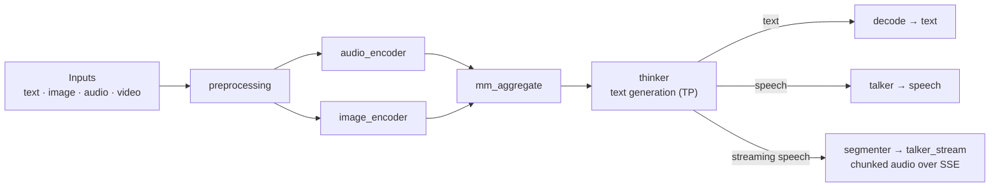

# Ming-Omni

[Ming-flash-omni-2.0](https://huggingface.co/inclusionAI/Ming-flash-omni-2.0) is a multimodal omni model that accepts text, image, audio, and video inputs and can return text or text + audio through SGLang-Omni's OpenAI-compatible `/v1/chat/completions` endpoint. In SGLang-Omni, Ming is served as a multi-stage pipeline: media preprocessing and encoders prepare multimodal embeddings, the thinker generates text, and the talker turns response text into 44.1 kHz speech.

Start with `sgl-omni serve` for Ming. The generic OmniServe entry point now knows how to build the Ming text and speech pipelines from the model path, so the commands below are the customer-facing launch path. For general chat request fields that also apply to Qwen3-Omni, see [Qwen3-Omni](./qwen3_omni.md).

## Prerequisites

Install `sglang-omni` by following [Installation](../get_started/installation.md), then make sure the Ming checkpoint is available:

```bash
hf download inclusionAI/Ming-flash-omni-2.0
```

The speech path expects the checkpoint to include the `talker/` assets, including `talker/data/voice_name.json` and `talker/vae/`. The default voice in the current Ming speech pipeline is `DB30`. `campplus.onnx` and `talker_tn` are optional runtime helpers: missing `campplus.onnx` disables speaker embedding extraction, and missing `talker_tn` falls back to identity text normalization.

`Ming-flash-omni-2.0` on HF does not ship top-level thinker tokenizer files. `load_ming_tokenizer` falls back to `inclusionAI/Ming-flash-omni-Preview` (~12 MB) to copy `tokenizer.json`, `tokenizer_config.json`, and `special_tokens_map.json`. In offline environments, download those files too:

```bash
hf download inclusionAI/Ming-flash-omni-Preview tokenizer.json tokenizer_config.json special_tokens_map.json
```

Ming-flash-omni-2.0 is a large MoE model. For practical serving, use tensor parallelism for the thinker. The examples below use logical GPU ids inside `CUDA_VISIBLE_DEVICES`; with `CUDA_VISIBLE_DEVICES=0,1,2,3,4`, `--thinker-gpus 0,1,2,3` means the thinker uses the first four visible GPUs and `--talker-gpu 4` uses the fifth visible GPU.

## Architecture



Media preprocessing and the audio/image encoders prepare multimodal embeddings, `mm_aggregate` fuses them, the thinker generates response text, and the terminal stage decides the output: `decode` for text, `talker` for full-utterance speech, or `segmenter -> talker_stream` for chunked streaming audio.

Ming has three serving variants:

| Variant | Pipeline | Output | Entry point |
|---|---|---|---|
| Text | `preprocessing -> audio_encoder + image_encoder -> mm_aggregate -> thinker -> decode` | Text | `sgl-omni serve --text-only` |
| Speech | Text pipeline plus `talker` terminal stage | Text + audio | `sgl-omni serve` |
| Streaming speech | Speech pipeline with `segmenter -> talker_stream` | Text + chunked audio over SSE | `MingOmniStreamingSpeechPipelineConfig` pipeline config |

When you pass only `--model-path`, OmniServe selects the default Ming speech pipeline. Add `--text-only` when you only need text output and want to avoid launching the talker. Streaming speech is a separate Ming pipeline variant; the benchmark section includes streaming evidence, but the ready copy-paste commands in this cookbook focus on the generic model-path text and speech paths.

The router, when used, routes whole requests to complete Ming workers. It does not split one request across the thinker and talker of different workers.

## Server Configuration

Use the selector below to generate the exact launch command for your configuration. Pick the output **Mode** (text-only or text + audio), the **Thinker TP** degree, an optional **Vision TP** degree for the image encoder, and the **Hardware** tier. GPUs are allocated without overlap — thinker ranks first, then the talker (speech mode), then the vision-encoder ranks — and the `CUDA_VISIBLE_DEVICES` prefix is sized to match.

```{raw} html
<div id="sgl-ming-server-gen-mount"></div>
```

`--text-only` selects the thinker-only pipeline (no talker, no audio). Omit it for the speech pipeline, which adds a dedicated `--talker-gpu`. The talker GPU must not overlap the thinker TP placement (the only placement Ming validates), so the generator always keeps it separate. The vision encoder defaults to GPU 0 alongside the thinker, so its TP ranks may either share the thinker GPUs (**With thinker**, the default) or take dedicated GPUs.

The **Hardware** toggle sets `--mem-fraction-static`:

| Tier | VRAM | `--mem-fraction-static` | Why |
|---|---|---|---|
| H100 | 80 GB | `0.80` | Baseline; weights plus a smaller KV pool fit at 0.80. |
| H200 | 141 GB | `0.90` | The MoE weights occupy roughly the same absolute space but a larger share is free, so a higher fraction is needed for the static budget to cover weights and still leave room for the KV pool; `0.80` can OOM at TP=2 because the reserved pool lands too small. |

Other large-memory parts (e.g. H20-3e 144 GB) behave like H200 — start at `0.9`. If your machine cannot fit the thinker without CPU offload, remove `--cpu-offload-gb 0` and let the launcher use its default offload setting (improves fit, reduces throughput).

For a smaller smoke run that uses OmniServe's default placement:

```bash
sgl-omni serve \
  --model-path inclusionAI/Ming-flash-omni-2.0 \
  --model-name ming-omni \
  --port 8000
```

This smoke command launches the default speech-capable Ming pipeline. Add `--text-only` if the smoke run should skip the talker.

### Vision Encoder Tensor Parallelism

The Ming image (vision) encoder can be sharded across GPUs with the dedicated `--image-encoder-tp-size` and `--image-encoder-gpus` flags, which mirror `--thinker-tp-size` / `--thinker-gpus`. `--image-encoder-gpus` takes one GPU id per TP rank as a comma list (`4,5`) or a JSON list (`[4, 5]`); the count must equal `--image-encoder-tp-size`. The encoder has 16 attention heads, so TP=2 and TP=4 both shard evenly. The selector above fills these in when you raise **Vision TP**. TP=1 (single GPU) is the default — sharding helps only when the vision encoder is a throughput bottleneck for image/video workloads.

By default the encoder runs on GPU 0 alongside the thinker, so its TP ranks can reuse the thinker GPUs (**Vision GPUs: With thinker**) with no extra hardware, valid when Vision TP ≤ Thinker TP. Choose **Dedicated** to place the ranks on their own GPUs when the thinker GPUs are memory-bound.

### Streaming Speech Client

Use the streaming speech pipeline when first-audio latency matters more than maximum aggregate throughput. The request shape is the same OpenAI-compatible chat-completions shape as the speech path, with `"stream": true`, and audio chunks arrive in `choices[0].delta.audio.data`.

The generic `sgl-omni serve --model-path` command currently exposes the default speech pipeline and the `--text-only` variant directly. Streaming speech uses the `MingOmniStreamingSpeechPipelineConfig` pipeline config. Until a public Ming streaming config is provided alongside the cookbook, treat the streaming numbers below as PR/local-patch evidence and use the non-streaming speech command above as the supported copy-paste launch.

The streaming pipeline is for audio chunks. The text-only `stream=true` path currently emits an aggregate text chunk instead of token-by-token text deltas.

### Placement and Memory Notes

Use `--thinker-tp-size` to set thinker tensor parallelism and `--thinker-gpus` to choose the logical GPU ids. `--cpu-offload-gb`, `--quantization`, and `--mem-fraction-static` are forwarded to the thinker server. Use `--talker-gpu` only for the speech pipeline, and keep it separate from the thinker GPUs. Use `--image-encoder-tp-size` / `--image-encoder-gpus` for image-encoder tensor parallelism. The selector above wires all of these placements consistently.

## Input and Output Examples

### Text Input, Text Output

```bash
curl -X POST http://localhost:8000/v1/chat/completions \
  -H "Content-Type: application/json" \
  -d '{
    "model": "ming-omni",
    "messages": [{"role": "user", "content": "Explain what tensor parallelism is in one sentence."}],
    "modalities": ["text"],
    "max_tokens": 128,
    "temperature": 0.0
  }'
```

Python:

```python
import requests

resp = requests.post(
    "http://localhost:8000/v1/chat/completions",
    json={
        "model": "ming-omni",
        "messages": [{"role": "user", "content": "Explain what tensor parallelism is in one sentence."}],
        "modalities": ["text"],
        "max_tokens": 128,
        "temperature": 0.0,
    },
)
resp.raise_for_status()
print(resp.json()["choices"][0]["message"]["content"])
```

Output (text-only TP4 server, `temperature: 0.0`):

```text
Tensor parallelism is a technique used in distributed computing to split large tensors across multiple devices, allowing for parallel computation and efficient processing of large-scale machine learning models.
```

### Image and Text Input

Top-level `images` are supported. The preprocessor injects them into the first user message and keeps media cache keys separate so multimodal placeholders do not alias in the prefix cache.

```bash
curl -X POST http://localhost:8000/v1/chat/completions \
  -H "Content-Type: application/json" \
  -d '{
    "model": "ming-omni",
    "messages": [{"role": "user", "content": "Describe this image in one sentence."}],
    "images": ["https://qianwen-res.oss-cn-beijing.aliyuncs.com/Qwen-VL/assets/demo.jpeg"],
    "modalities": ["text"],
    "max_tokens": 64,
    "temperature": 0.0
  }'
```

Python:

```python
import requests

resp = requests.post(
    "http://localhost:8000/v1/chat/completions",
    json={
        "model": "ming-omni",
        "messages": [{"role": "user", "content": "Describe this image in one sentence."}],
        "images": ["https://qianwen-res.oss-cn-beijing.aliyuncs.com/Qwen-VL/assets/demo.jpeg"],
        "modalities": ["text"],
        "max_tokens": 64,
        "temperature": 0.0,
    },
)
resp.raise_for_status()
print(resp.json()["choices"][0]["message"]["content"])
```

Output (the woman-and-dog beach image, `temperature: 0.0`):

```text
A woman and her dog are sitting on the beach, sharing a high-five as the sun sets in the background.
```

### Audio and Image Input

Provide both `images` and `audios`; a text prompt can direct the model to attend to each:

```bash
curl -X POST http://localhost:8000/v1/chat/completions \
  -H "Content-Type: application/json" \
  -d '{
    "model": "ming-omni",
    "messages": [{"role": "user", "content": "What is said in the audio, and what is shown in the image?"}],
    "images": ["https://qianwen-res.oss-cn-beijing.aliyuncs.com/Qwen-VL/assets/demo.jpeg"],
    "audios": ["https://huggingface.co/datasets/zhaochenyang20/seed-tts-eval-mini/resolve/main/en/prompt-wavs/common_voice_en_10119832.wav"],
    "modalities": ["text"],
    "max_tokens": 64,
    "temperature": 0.0
  }'
```

Python:

```python
import requests

resp = requests.post(
    "http://localhost:8000/v1/chat/completions",
    json={
        "model": "ming-omni",
        "messages": [{"role": "user", "content": "What is said in the audio, and what is shown in the image?"}],
        "images": ["https://qianwen-res.oss-cn-beijing.aliyuncs.com/Qwen-VL/assets/demo.jpeg"],
        "audios": ["https://huggingface.co/datasets/zhaochenyang20/seed-tts-eval-mini/resolve/main/en/prompt-wavs/common_voice_en_10119832.wav"],
        "modalities": ["text"],
        "max_tokens": 64,
        "temperature": 0.0,
    },
)
resp.raise_for_status()
print(resp.json()["choices"][0]["message"]["content"])
```

Output (English speech sample plus the beach image; truncated at `max_tokens: 64`):

```text
The audio clip features a woman's voice, while the image depicts a woman and a dog on a beach. The woman in the image is sitting on the sand, facing the dog, and appears to be interacting with it. The dog is sitting upright, looking at the woman, and seems to be engaged in the interaction
```

### Video Input

Video files use the same top-level request style. Limit frame count or pixel budget for predictable latency:

```bash
curl -X POST http://localhost:8000/v1/chat/completions \
  -H "Content-Type: application/json" \
  -d '{
    "model": "ming-omni",
    "messages": [{"role": "user", "content": "Describe the action in this video."}],
    "videos": ["https://qianwen-res.oss-cn-beijing.aliyuncs.com/Qwen2-VL/space_woaudio.mp4"],
    "video_max_frames": 16,
    "modalities": ["text"],
    "max_tokens": 96,
    "temperature": 0.0
  }'
```

Python:

```python
import requests

resp = requests.post(
    "http://localhost:8000/v1/chat/completions",
    json={
        "model": "ming-omni",
        "messages": [{"role": "user", "content": "Describe the action in this video."}],
        "videos": ["https://qianwen-res.oss-cn-beijing.aliyuncs.com/Qwen2-VL/space_woaudio.mp4"],
        "video_max_frames": 16,
        "modalities": ["text"],
        "max_tokens": 96,
        "temperature": 0.0,
    },
)
resp.raise_for_status()
print(resp.json()["choices"][0]["message"]["content"])
```

Output (short clip of two astronauts on a space station, `temperature: 0.0`):

```text
The video shows two astronauts inside a space station. One astronaut is holding a microphone and speaking, while the other is standing with his arms crossed. The background includes various equipment and a laptop.
```

### Text Input, Text + Audio Output

Launch the speech server first (the `Text + Audio Output` command above), then request audio with `modalities: ["text", "audio"]`. The speech reply comes back in `choices[0].message.audio.data` as base64 WAV.

```bash
curl -s -X POST http://localhost:8000/v1/chat/completions \
  -H "Content-Type: application/json" \
  -d '{
    "model": "ming-omni",
    "messages": [{"role": "user", "content": "Read this sentence aloud: This model understands text, images, audio, and video, and can reply with either text or speech."}],
    "modalities": ["text", "audio"],
    "audio": {"format": "wav"},
    "max_tokens": 64,
    "temperature": 0.0
  }' \
  | python3 -c 'import sys, json, base64; m = json.load(sys.stdin)["choices"][0]["message"]; print(m.get("content", "")); open("ming_output.wav", "wb").write(base64.b64decode(m["audio"]["data"]))'
```

Python:

```python
import base64
import requests

resp = requests.post(
    "http://localhost:8000/v1/chat/completions",
    json={
        "model": "ming-omni",
        "messages": [{"role": "user", "content": "Read this sentence aloud: This model understands text, images, audio, and video, and can reply with either text or speech."}],
        "modalities": ["text", "audio"],
        "audio": {"format": "wav"},
        "max_tokens": 64,
        "temperature": 0.0,
    },
)
resp.raise_for_status()
message = resp.json()["choices"][0]["message"]
print(message.get("content", ""))

audio = base64.b64decode(message["audio"]["data"])
with open("ming_output.wav", "wb") as f:
    f.write(audio)
```

Output (speech server, `temperature: 0.0`):

```text
This model understands text, images, audio, and video, and can reply with either text or speech.
```

`ming_output.wav` is a mono WAV carrying the talker's 44.1 kHz speech (~700 KB for this ~8 s reply).

Reference output:

<audio controls>
  <source src="../_static/audio/ming-omni-intro.wav" type="audio/wav">
</audio>

### Streaming Speech

With a streaming speech server, set `"stream": true` and consume Server-Sent Events. Audio chunks arrive in `choices[0].delta.audio.data`. To inspect the raw SSE stream with curl (use `-N` to disable buffering):

```bash
curl -N -X POST http://localhost:8000/v1/chat/completions \
  -H "Content-Type: application/json" \
  -d '{
    "model": "ming-omni",
    "messages": [{"role": "user", "content": "Say one friendly sentence."}],
    "modalities": ["text", "audio"],
    "audio": {"format": "wav"},
    "stream": true,
    "max_tokens": 64,
    "temperature": 0.0
  }'
```

Python (decodes and writes each audio chunk):

```python
import base64
import json
from pathlib import Path

import requests

chunk_paths: list[Path] = []

with requests.post(
    "http://localhost:8000/v1/chat/completions",
    json={
        "model": "ming-omni",
        "messages": [{"role": "user", "content": "Say one friendly sentence."}],
        "modalities": ["text", "audio"],
        "audio": {"format": "wav"},
        "stream": True,
        "max_tokens": 64,
        "temperature": 0.0,
    },
    stream=True,
    timeout=600,
) as resp:
    resp.raise_for_status()
    for line in resp.iter_lines(decode_unicode=True):
        if not line or not line.startswith("data: "):
            continue
        data = line.removeprefix("data: ")
        if data == "[DONE]":
            break
        event = json.loads(data)
        delta = event["choices"][0].get("delta", {})
        if delta.get("content"):
            print(delta["content"], end="", flush=True)
        audio = delta.get("audio") or {}
        if audio.get("data"):
            chunk = base64.b64decode(audio["data"])
            chunk_path = Path(f"ming_stream_chunk_{len(chunk_paths):03d}.wav")
            chunk_path.write_bytes(chunk)
            chunk_paths.append(chunk_path)
```

The example writes each audio chunk as a separate WAV file. If you want one playback file, parse each WAV chunk and concatenate PCM frames with a standard audio library.

Output: with the streaming speech pipeline the audio arrives as multiple `delta.audio.data` chunks. Against the **non-streaming** speech server (the `Text + Audio Output` command), `stream: true` still returns valid SSE but the audio comes back as a single aggregate chunk after generation — for example one text delta carrying `Hello! How can I assist you today?`, one ~276 KB aggregate WAV chunk, and a final `finish_reason: stop` event before `[DONE]`:

```text
Hello! How can I assist you today?
```

The streamed WAV chunks carry the same 44.1 kHz speech as the non-streaming reply.

## Request Parameters

| Parameter | Default | Notes |
|---|---|---|
| `model` | `null` | Use the `--model-name` value from launch, usually `ming-omni`. |
| `messages` | required | OpenAI-style chat messages. Content can be a string or a list of typed media parts. |
| `modalities` | `["text"]` | Use `["text"]` for text output and `["text", "audio"]` for speech output. |
| `images` | `null` | List of local paths or URLs. |
| `audios` | `null` | List of local paths or URLs. Audio is loaded at 16 kHz for the Whisper-style audio encoder. |
| `videos` | `null` | List of local paths or URLs. |
| `video_fps` | `null` | Optional frame sampling rate. |
| `video_max_frames` | `null` | Optional cap on sampled frames. |
| `video_min_pixels` | `null` | Minimum per-frame pixel budget passed to video preprocessing. |
| `video_max_pixels` | `null` | Maximum per-frame pixel budget passed to video preprocessing. |
| `video_total_pixels` | `null` | Total pixel budget across sampled frames. |
| `max_tokens` | `2048` | Forwarded to Ming as `max_new_tokens`. |
| `temperature` | `1.0` | Chat-completions default. Set 0.0 for greedy deterministic examples. |
| `top_p` | `1.0` | Thinker sampling. |
| `top_k` | `-1` | Thinker sampling. |
| `min_p` | `0.0` | Thinker sampling. |
| `repetition_penalty` | `1.0` | Thinker sampling. |
| `stop` | `[]` | Stop string or list of stop strings. |
| `seed` | `null` | Forwarded as `sampling_seed`. |
| `stream` | `false` | Use with the streaming speech pipeline for audio chunks. |
| `audio.format` | `wav` | Chat-completions audio format. |
| `stage_params` | `null` | Advanced per-stage parameters. |

## Benchmark Results

The numbers below are directional H100-class serving evidence for SGLang-Omni serving Ming-flash-omni-2.0 under matched prompts, sampling settings, and decode parameters. They are useful for setting expectations, not universal guarantees; keep the caveats with the numbers when quoting them.

### Text Thinker (GSM8K)

Pure text thinker path, text-only output, 100 samples from the GSM8K `main` test split (first 100 of 1319 problems, deterministic file order), greedy (T=0), TP=4 thinker.

| Concurrency | Throughput | Mean latency | Accuracy |
|---:|---:|---:|---:|
| 1 | `0.615 qps` | `1.63 s` | 94% |
| 4 | `1.938 qps` | `2.06 s` | 95% |
| 16 | `4.608 qps` | `3.26 s` | 95% |

Throughput scales roughly linearly from c=1 to c=16 (~7.5×) at stable accuracy.

### Image-Text (MMMU)

Image-text input, text output, 50 samples from the full `MMMU/MMMU` `validation` split (all 30 subjects, sorted by sample id, first 50 with images — not the `zhaochenyang20/mmmu-ci-50` CI subset), greedy (T=0), TP=4 thinker.

| Concurrency | Throughput | Mean latency | Median latency | Accuracy |
|---:|---:|---:|---:|---:|
| 1 | `0.144 qps` | `6.70 s` | `3.48 s` | 60% |
| 2 | `0.251 qps` | `7.69 s` | `4.35 s` | 64% |
| 4 | `0.454 qps` | `8.47 s` | `4.89 s` | 66% |
| 8 | `0.720 qps` | `10.47 s` | `6.25 s` | 64% |
| 16 | `0.996 qps` | `14.16 s` | `8.92 s` | 62% |

Throughput scales ~6.9× from c=1 to c=16; accuracy stays within MMMU sample noise.

### Non-Streaming Talker

Speech output (`modalities=["text","audio"]`), voice `DB30`, uniform prompt, TP=4 thinker + dedicated talker GPU. Measured against the 7-stage non-streaming `MingOmniSpeechPipelineConfig` with `stream=false` (not the streaming pipeline); every request returned real 44.1 kHz audio (`n_fail=0`, mean ~6.3 s/clip).

| Concurrency | Throughput | Mean wall | p95 wall |
|---:|---:|---:|---:|
| 1 | `2.02 req/s` | `0.493 s` | `0.522 s` |
| 2 | `2.87 req/s` | `0.68 s` | `0.74 s` |
| 4 | `3.01 req/s` | `1.25 s` | `1.39 s` |
| 8 | `2.92 req/s` | `2.35 s` | `2.77 s` |
| 16 | `3.03 req/s` | `3.70 s` | `5.01 s` |

The talker is single-stream (`SimpleScheduler.max_concurrency=1`), which enables the CFM CUDA-graph capture and keeps c=1 latency low. Throughput plateaus near `3 req/s` at high concurrency.

### Streaming Talker

Streaming speech is a low-concurrency UX path: it trades some throughput for much earlier first audio. Same backend, same voice `DB30`. First audio is time-to-first-audio-chunk (TTFA) for streaming and full-response wall time for non-streaming.

| Concurrency | Streaming TTFA | Non-streaming first audio | Streaming throughput | Non-streaming throughput |
|---:|---:|---:|---:|---:|
| 1 | `0.236 s` | `0.509 s` | `1.206 req/s` | `1.956 req/s` |
| 2 | `0.593 s` | `0.653 s` | `1.288 req/s` | `2.989 req/s` |
| 4 | `1.269 s` | `1.260 s` | `1.368 req/s` | `2.990 req/s` |
| 8 | `2.675 s` | `2.280 s` | `1.410 req/s` | `3.006 req/s` |
| 16 | `4.474 s` | `3.697 s` | `1.448 req/s` | `3.011 req/s` |

At c=1 streaming delivers first audio ~2.2× sooner at a ~38% throughput cost. The crossover is around c≈4; past it, single-stream queuing makes streaming's first chunk arrive later than the non-streaming full response. Each streaming request emits ~20 chunks at ~19 ms intervals. The streaming measurements are from PR/local-patch evidence, not a release-wide guarantee; cite streaming as a low-concurrency first-audio win rather than a universal throughput win.

### Audio Equivalence

A small c=1 audit (single prompt, single voice, n=4 WAVs per mode) checks that the streaming path preserves audio content versus non-streaming on the same backend.

| Comparison | Result |
|---|---|
| Streaming vs non-streaming | Intelligible-equivalent: CER 0/0 on both, mel-L2 cross-mode ~1.5× within-mode baseline, duration delta <3%. |

Intelligibility is fully preserved; streaming and non-streaming are close but not bit-identical (expected from chunked-decode windowing).

## Known Limitations

- **Ming is large.** Use thinker TP and plan GPU placement deliberately. On 80 GB H100-class GPUs the MoE thinker does not fit on a single GPU, so bare default placement (no `--thinker-tp-size`) out-of-memories during startup — TP=4 is the smallest placement that loads (TP=1 and TP=2 both OOM). CPU offload can make the model fit on fewer GPUs but slows inference.
- **Speech is 44.1 kHz; the chat-completions WAV header is currently mislabeled.** The talker produces 44.1 kHz audio, but the non-streaming and streaming completion paths stamp the returned WAV header at 24000 Hz — `completion()` / `completion_stream()` do not forward `chunk.sample_rate`, so `encode_audio` falls back to `DEFAULT_SAMPLE_RATE = 24000` (`sglang_omni/client/audio.py`). The samples are not resampled, so the audio is genuine 44.1 kHz — set the WAV header to `44100` when saving if your player honors it. The `/v1/audio/speech` path already forwards the rate.
- **Image-encoder TP is set with dedicated flags.** Use `--image-encoder-tp-size` and `--image-encoder-gpus` (see [Vision Encoder Tensor Parallelism](#vision-encoder-tensor-parallelism)). The generic dotted `--stages.<i>.gpu` CLI override only accepts a single integer GPU id, so it cannot express a per-rank GPU list — use the dedicated flags instead.
- **Speech output uses `/v1/chat/completions`.** Ming's omni speech path is chat-completions text + audio, not the `/v1/audio/speech` TTS endpoint used by S2-Pro, Higgs, Voxtral, and Qwen3-TTS.
- **Streaming speech launch needs a pipeline config today.** Generic `sgl-omni serve --model-path` exposes default speech and `--text-only` directly. Streaming speech uses `MingOmniStreamingSpeechPipelineConfig`.
- **Text streaming is not token-by-token today.** In the current Ming path, text-only `stream=true` currently emits an aggregate text chunk. Use streaming speech when you need audio chunks.
- **Streaming speech is optimized for low client concurrency.** It improves first-audio latency at c=1 but can be slower than non-streaming for multi-client workloads.
- **Long-form speech can drift.** For long narration, split text into smaller turns or run a voice/drift audit for your target voice and language.
