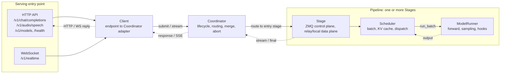
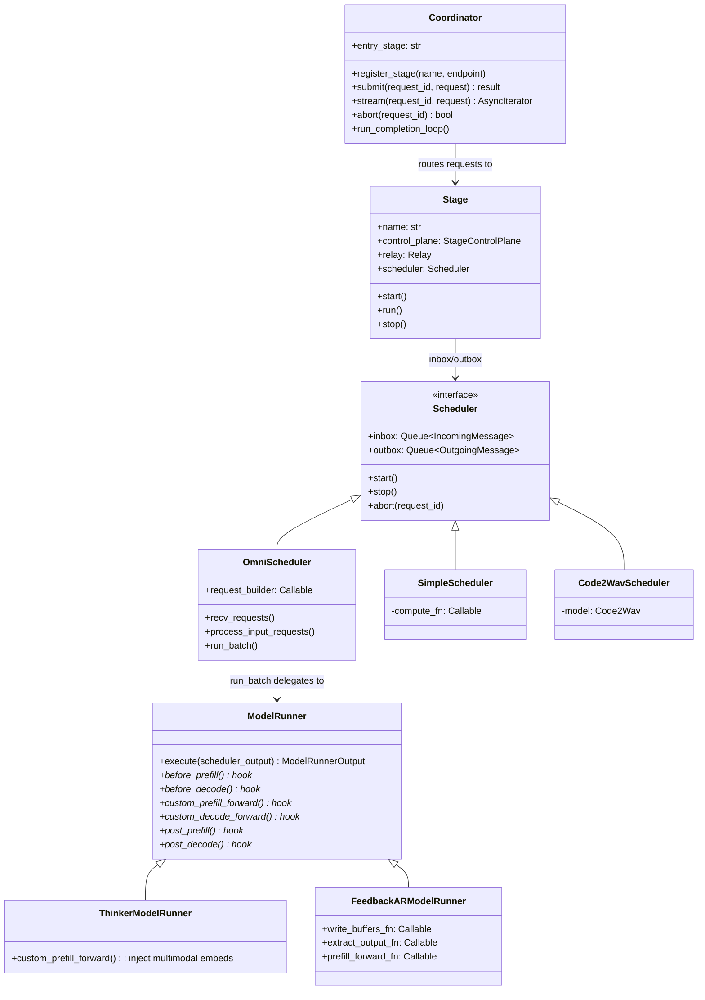
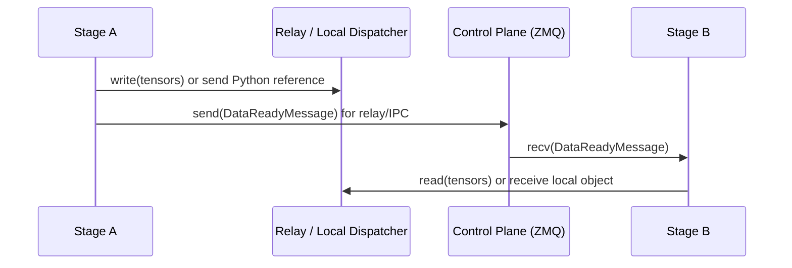
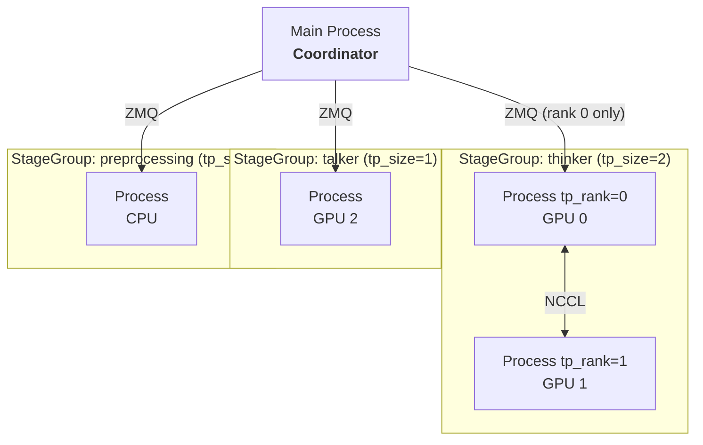
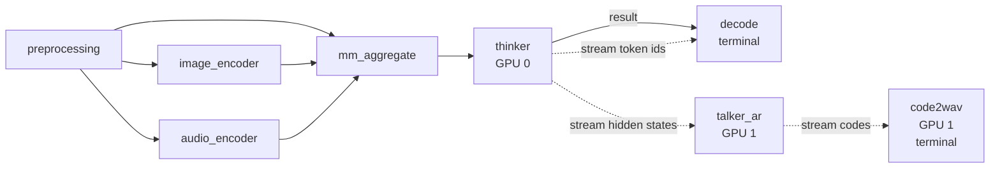
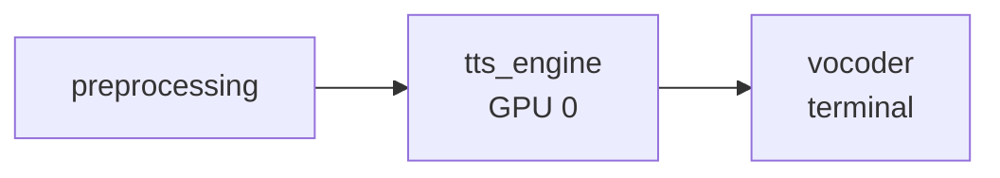
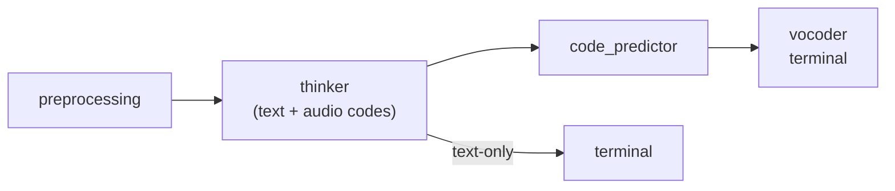
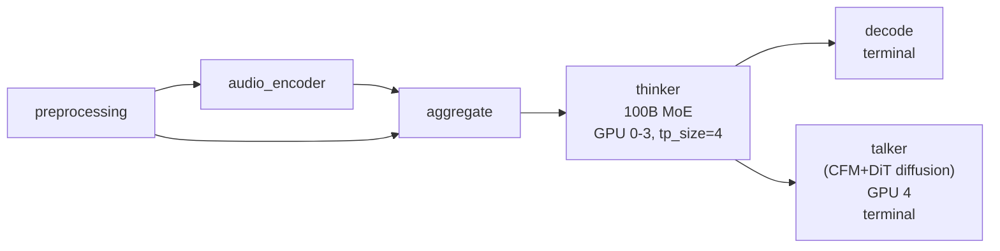

# SGLang Omni Refactor Tracking

---

Follows from [sglang#16546](https://github.com/sgl-project/sglang/issues/16546). Addresses problems in [#188](https://github.com/sgl-project/sglang-omni/issues/188).

## Table of contents

1. [Architecture](#architecture)
2. [Pipeline Layer](#pipeline-layer)
3. [Scheduling Layer](#scheduling-layer)
4. [Model Runner + Callbacks](#model-runner--callbacks)
5. [Model Directory Convention](#model-directory-convention)
6. [Declarative Config](#declarative-config)
7. [Multi-Process Runner](#multi-process-runner)
8. [Supported Pipelines](#supported-pipelines)
9. [Adding a New Model](#adding-a-new-model)
10. [Progress Tracking](#progress-tracking)
11. [Design Decision History](#design-decision-history)

## Architecture

### System Overview

The request lifecycle: HTTP and WebSocket requests enter through the serving layer, the Client adapts them into Coordinator calls, the Coordinator drives one or more pipeline Stages, and results stream back along the same path.



Text form: `HTTP API / WebSocket → Client → Coordinator → Stage → [Scheduler → ModelRunner → forward]`.

### Layer Responsibilities

| Layer           | Responsibility                                                                     | Model-aware? |
| --------------- | ---------------------------------------------------------------------------------- | ------------ |
| **Coordinator** | Request lifecycle, routing to entry stage, multi-terminal merge, abort broadcast   | No           |
| **Stage**       | IO shell — ZMQ control plane, transport data plane, fan-in aggregation, stream routing | No           |
| **Scheduler**   | Batch selection, KV cache management, compute dispatch                             | Partially    |
| **ModelRunner** | Forward pass, sampling, model-specific hooks                                       | Yes          |

### Directory Layout

```
sglang_omni/
├── pipeline/           # Inter-stage orchestration (model-agnostic)
├── scheduling/         # Scheduling loops (OmniScheduler, SimpleScheduler)
├── model_runner/       # Model runner base + shared FeedbackARModelRunner
├── models/             # Model definitions + pipeline configs
├── config/             # Pipeline config schema + compiler
├── relay/              # Data transfer backends (SHM, NCCL, NixL)
├── serve/              # HTTP server, OpenAI API
├── client/             # Client library
└── proto/              # Message types
```

### Class Diagram



### End-to-end example: Fish Audio S2-Pro

The diagram below traces a single `/v1/audio/speech` request through every layer described above, using the 3-stage Fish S2-Pro pipeline as a concrete instance. The left column is the request lifecycle (HTTP → Client → Coordinator and back); the right column is the three pipeline stages, each showing its scheduler, model runner, and the ZMQ (control-plane) vs relay (data-plane) hand-offs between them.


It is a worked example of the abstractions in this section: the Coordinator routes and merges, each Stage owns one Scheduler, and the model-specific work lives entirely in the runner + callbacks — the rest is reused framework code.

---

## Pipeline Layer

### HTTP/Websocket

HTTP and WebSocket are SGLang-Omni's externally exposed request endpoints.

- **HTTP:**
  - `POST /v1/chat/completions`
  - `POST /v1/audio/speech`
  - `GET /v1/models`
  - `GET /health`
- **WebSocket:**
  - `WS /v1/realtime`

HTTP covers the request/response endpoints; the WebSocket endpoint (`/v1/realtime`, see [Design Decision History § PR #385](#2026-05-04--pr-385-openai-realtime-websocket-endpoint-v1-feature)) is full-duplex for streaming audio in and server events out. There is no application-level HTTPS/TLS layer: the server binds plain HTTP via uvicorn, and TLS is expected to terminate at a reverse proxy or load balancer in front of it.

### Client

The Client is the adapter between the HTTP/WebSocket endpoints and the Coordinator: it is where each endpoint is actually implemented.

For example, `/v1/audio/speech` refines the request, calls `generate`, and returns the refined output.

Code part:

```python
async for chunk in self.generate(request, request_id=request_id):
    if chunk.audio_data is not None:
        audio_chunks.append(chunk.audio_data)
    if chunk.sample_rate is not None:
        sample_rate = chunk.sample_rate
    last_chunk = chunk
```

### Coordinator

Global request router. Tracks the request lifecycle across stages.

1. Routes new requests to the entry stage
2. Collects completions from terminal stages
3. Merges results when multiple terminal stages exist (e.g., `decode` + `code2wav`)
4. Broadcasts abort to all stages

### Stage

IO shell. Every stage has one scheduler (no branching). Handles all inter-stage communication.

```python
class Stage:
    def __init__(self, name, control_plane, relay, route_fn,
                 input_handler, scheduler, stream_targets,
                 same_gpu_targets, same_process_targets, local_dispatcher):
        self.scheduler = scheduler  # always present
```

Responsibilities:

- **Control plane (ZMQ):** receive `SubmitMessage`, `DataReadyMessage`, `AbortMessage`
- **Data plane:** read/write tensors via relay, CUDA IPC stream fast path, or
  same-process LOCAL_OBJECT dispatch
- **Input aggregation:** wait for multiple upstream stages before dispatching (`AggregatedInput`)
- **Stream routing:** receive/send streaming chunks (hidden states, codec codes)
- **Dispatch:** push all messages into `scheduler.inbox`, drain `scheduler.outbox`

One code path. Stage never checks scheduler type.

### Inter-Stage Communication



- **Control plane (ZMQ):** small messages — Submit, DataReady, Abort, Shutdown. PUB/SUB for abort broadcast, PUSH/PULL for point-to-point.
- **Data plane:** large tensors normally go through relay. Pluggable backends: SHM (single machine), NCCL (multi-GPU), NixL (RDMA multi-node), Mooncake. Same-GPU stream edges use CUDA IPC automatically. Same-process safe edges may use LOCAL_OBJECT and pass the original Python object by reference.
- **Streaming:** hidden states / codec codes flow via `DataReadyMessage` with `chunk_id` and `is_done` fields, parallel to normal result routing.

LOCAL_OBJECT is a Stage-level fast path, not a relay backend. It is used only
when runtime prep knows sender and receiver live in the same OS process. Full
payload dispatch can use it for single-target routes; projected fan-out can use
it only when each projector returns a `StagePayload` with an isolated `data`
container. The receiver sees the same Python object references, including nested
tensors and metadata, so downstream code must treat them as read-only until the
receiver has finished with the request.

The split between control and data planes is the core architectural decision: ZMQ stays out of the tensor path (it carries only the small `SubmitMessage` / `DataReadyMessage` / `AbortMessage` coordination messages), the relay (SHM/NCCL/NIXL/Mooncake) stays out of the coordination path, and either can be swapped independently.

#### Why not Ray?

The thinker→talker relationship is fundamentally producer–consumer: thinker produces hidden states / text tokens, talker consumes them and emits audio codes. Structurally this is the same pattern as RL training (actor produces trajectories, learner consumes them), where Ray is the dominant orchestration layer. So it is a fair first-principles question whether we should use Ray for inter-stage scheduling instead of hand-rolling ZMQ + relay.

We chose not to. Ray's overhead — extra runtime, object-store semantics, and operational footprint — is significant for our shape: a small fixed number of stages on a small fixed number of GPUs, with no autoscaling. ZMQ + relay covers the topology with much less moving infrastructure. The decision is revisitable; nothing in the pipeline layer hard-bakes "no Ray" beyond the relay backend list.

### `relay_io` Utility Module

Utility module providing:

- **User-facing API**
  - `write_payload` / `read_payload` — full `StagePayload` serialization via relay
  - `send_stream_chunk` — handles same-GPU IPC vs cross-GPU relay, NIXL credit deadlock avoidance
- **Same-process dispatch**
  - `LocalStageDispatcher` — directly calls target stage receive methods with
    Python object references for LOCAL_OBJECT payloads and stream chunks
- **Internal-facing API**
  - `write_blob` / `read_blob` — raw tensor transfer for streaming chunks
  - `extract_tensors` / `restore_tensors` — recursive tensor extraction from nested dicts

**API layering.** Stages only call the user-facing API. `write_blob` / `read_blob` get wrapped by `send_stream_chunk` for cross-GPU transfer; `extract_tensors` / `restore_tensors` get used inside `write_payload` / `read_payload` to pull tensors out of nested dicts. The internal layer exists so the user-facing surface stays small.

**Asymmetric stream API — no `recv_stream_chunk`.** Only `send_stream_chunk` exists because the sender has real decisions to make (same-GPU IPC vs cross-GPU relay, NIXL credit management), while the receiver just calls `read_blob` from the stage's main message loop. Wrapping a one-liner into `recv_stream_chunk` would add a layer without adding any value.

---

## Scheduling Layer

All schedulers share the same interface: `inbox`, `outbox`, `start()`, `stop()`, `abort()`.

### OmniScheduler — Composition with SGLang

For AR stages. Subset of SGLang Scheduler — reuses `get_next_batch_to_run()`, `run_batch()`, `process_batch_result()`, `event_loop_normal()`, overlap scheduling.

- **Reused from SGLang:** `get_next_batch_to_run()`, `process_batch_result()`, `self_check_during_idle()` — KV cache management, prefill/decode scheduling, tree cache, dLLM support
- **Overridden:** `init` (skip ZMQ/tokenizer/metrics), `recv_requests()` (drain inbox, route stream chunks to per-request state), `process_input_requests()` (`request_builder` conversion), `run_batch()` (delegate to ModelRunner), `send_to_tokenizer()` (no-op)
- **Not used from SGLang:** ZMQ channels, tokenizer init, grammar backend, metrics exporter, disaggregation, LoRA, speculative decoding, PP, watchdog

Runs in a dedicated thread. Stage communicates via thread-safe queues.

#### Composition boundary with SGLang

Composing on top of SGLang's `Scheduler` is the right call, but only if we pin the boundary deliberately — RL forks of SGLang have hit upgrade pain by letting composition drift into a de facto fork. Three rules govern the boundary:

1. **Pin, don't track.** Tracking SGLang `main` fits the same-umbrella relationship, but only if CI runs against the real Scheduler rather than mocks. Running that CI is currently too expensive, so we pin.
2. **Minimize reuse surface.** Treat `PrefillManager` and `DecodeManager` as black boxes — public methods only, no reads or writes of internal attributes. The moment we touch internals, composition becomes a fork.
3. **Upstream-first, when affordable.** If OmniScheduler needs something SGLang doesn't cleanly expose, the preferred fix is a hook or factored-out method in SGLang `main` rather than a downstream patch. Today the cost of upstream PRs is high enough that we don't routinely do this; it remains the long-term direction.

`CodePredictor` is placed under Talker, but whether `ThinkerScheduler` and `CodePredictorScheduler` need a separate documented split (their KV cache shapes are quite different) is tracked in [#538 §2.1](https://github.com/sgl-project/sglang-omni/issues/538).

### Error handling

Previously the same OOM produced different externally-visible behaviors across models: S2-Pro and Voxtral returned HTTP 500 (correct), Ming-Omni returned HTTP 200 with `waveform=None` (silent failure), Qwen3-Omni returned HTTP 200 with a zero tensor (looks like a valid waveform downstream). The first two were correct only because they did nothing; the latter two failed because broad `except Exception` blocks in the executor swallowed the error. The fix lives at the Scheduler layer (#449):

1. **Unified catch in `run_batch()`** — Scheduler wraps forward, catches exceptions, marks the request failed, propagates via outbox → Coordinator → HTTP 500 for non-streaming. For streaming responses HTTP headers are already flushed before the first chunk, so HTTP 500 cannot fire mid-stream — successful streams terminate with an explicit completion sentinel frame, and failed streams abort the connection before emitting it. Absent sentinel + premature close is the client-side failure signal.
2. **Model executors forbidden from writing `except Exception`** — model-side code is pure functional and exceptions propagate naturally. Specific expected exceptions must catch specific types, never base `Exception`. Enforced via lint rule, not review discipline: rule 1's catch is path-local to `run_batch()`, so a broad catch in `add_request` or embed-load paths slips past it.
3. **Fallbacks architecturally disallowed** — executor either succeeds or hands off to Scheduler. No third path returning a "fake success" indistinguishable from a real result.
4. **CI fault injection** — inject OOM and verify the correct failure signal per model: HTTP 500 for non-streaming, sentinel-absent + premature close for streaming. Detection complements but does not substitute for rule 2's lint enforcement.

The short-term bridge fix (#302) landed without an `is_oom_error()` helper, since that helper would become dead code once the Scheduler-layer catch lands.

### SimpleScheduler

For non-AR stages (preprocessing, encoders, aggregate, decode). No KV cache, no batching. Just `inbox.get()` → `fn(data)` → `outbox.put()`. Supports inbox/outbox and basic forward operation; batched processing supported where useful.

### Code2WavScheduler

Streaming vocoder. Handles:

- `new_request` → init
- `stream_chunk` → accumulate + decode
- `stream_done` → flush + output

### Message Types

```python
class IncomingMessage:
    request_id: str
    type: "new_request" | "stream_chunk" | "stream_done"
    data: Any

class OutgoingMessage:
    request_id: str
    type: "result" | "stream"
    data: Any
    target: str | None  # for stream: downstream stage name
```

---

## Model Runner + Callbacks

```
ForwardBatch → before_*() → custom_*_forward() or standard forward → post_*() → sample/output
                    ↑ hook             ↑ explicit custom path          ↑ hook
```

| Runner                    | Used by                | Hook behavior                                                        |
| ------------------------- | ---------------------- | -------------------------------------------------------------------- |
| **ThinkerModelRunner**    | Qwen3 / Ming thinker   | `custom_prefill_forward`: inject multimodal embeddings                |
| **FeedbackARModelRunner** | Qwen3 talker, Fish TTS | `before_*` buffer writes + optional explicit `custom_*_forward` paths |

CUDA Graph and `torch.compile` are class-shareable rather than configured model by model — the ModelRunner abstraction exists in part to make this the default; special models can still override.

DiffusionModelRunner is no longer speculative — Ming-Omni (#236) requires it, and image-gen diffusion is functionally working. It should be added as a first-class runner type alongside `ThinkerModelRunner` and `FeedbackARModelRunner` later.

### `ModelRunner` (Base)

Shared execute pipeline for all AR models.

```python
class ModelRunner:
    def execute(self, scheduler_output):
        forward_batch = ForwardBatch.init_new(...)
        if is_prefill:
            self.before_prefill(forward_batch, ...)
            batch_result = self.custom_prefill_forward(forward_batch, ...)
        else:
            self.before_decode(forward_batch, ...)
            batch_result = self.custom_decode_forward(forward_batch, ...)
        if batch_result is None:
            batch_result = self.tp_worker.forward_batch_generation(forward_batch)
        if is_prefill:
            self.post_prefill(batch_result, ...)
        else:
            self.post_decode(batch_result, ...)
        # sample, logit processing, output extraction
        return ModelRunnerOutput(...)
```

Shared: `ForwardBatch` construction, sampling, repetition penalty, codec suppression, output processing.

The earlier single `prepare_forward` hook was misleading: it did two unrelated things at once, mutating the batch and short-circuiting to a custom forward result. Those concerns are now split, as the `execute` skeleton above shows: phase-aware `before_prefill` / `before_decode` mutate the batch in place, and explicit `custom_prefill_forward` / `custom_decode_forward` hooks return a forward result (or `None` to fall through to the standard forward). Landed in [#558](https://github.com/sgl-project/sglang-omni/pull/558).

### `ThinkerModelRunner`

Injects multimodal embeddings (image / video / audio) + deepstack before forward.

```python
class ThinkerModelRunner(ModelRunner):
    def custom_prefill_forward(self, ...):
        # Inject multimodal embeds into forward_batch
        ...
```

### `FeedbackARModelRunner`

Shared model runner for all AR + codebook models (Qwen3 talker, Fish TTS, future models) whose feedback loop is **self-contained within a single ModelRunner instance** — both the feedback producer and the receiver live inside one decode step. Cross-stage feedback (producer and receiver in separate schedulers, communicating via relay) is out of scope for this abstraction and would need a different design; today nothing requires it, but stating the boundary up front prevents future contributors from bending the abstraction to cover topologies it was not designed for.

The model's `forward()` handles backbone + secondary head internally. This runner writes / reads model buffers around forward.

```python
class FeedbackARModelRunner(ModelRunner):
    def __init__(self, tp_worker, output_processor, outbox, *,
                 write_buffers_fn, extract_output_fn, prefill_forward_fn=None):
        ...

    def before_decode(self, ...):
        if decode:
            self._write_buffers(model, schedule_batch, requests)

    def custom_prefill_forward(self, ...):
        if prefill and self._prefill_forward:
            return self._prefill_forward(tp_worker, forward_batch, ...)
        return None

    def post_prefill(self, ...):
        self._extract_output(model, schedule_batch, requests, outbox)

    def post_decode(self, ...):
        self._extract_output(model, schedule_batch, requests, outbox)
```

Model-specific behavior via three callbacks:

- `write_buffers_fn`: write previous step's feedback into model buffers
- `extract_output_fn`: read codes / feedback from model after forward
- `prefill_forward_fn`: custom forward for prefill (optional)

#### Callback pattern: bare functions vs Strategy object

Each model currently provides three bare functions that get passed in individually. This works, but the three are semantically coupled — they all operate on the same model's buffers — and nothing at the type level enforces that coupling.

A lightweight improvement is to collect them into a Strategy object:

```python
class FeedbackStrategy(Protocol):
    def write_buffers(self, model, schedule_batch, requests) -> None: ...
    def extract_output(self, model, schedule_batch, requests, outbox) -> None: ...
    def prefill_forward(self, tp_worker, forward_batch, ...) -> Optional[BatchResult]: ...

class QwenTalkerStrategy:
    def write_buffers(self, model, schedule_batch, requests):
        # feedback_embeds + trailing/pad → model._feedback_buffer
    def extract_output(self, model, schedule_batch, requests, outbox):
        # model._output_codes → outbox, _output_embeds → feedback
    def prefill_forward(self, tp_worker, forward_batch, ...):
        # projected input_embeds prefill

class FishTTSStrategy:
    def write_buffers(self, ...): ...
    def extract_output(self, ...): ...
    def prefill_forward(self, ...): ...
```

The bare-function form is what ships today; the Strategy form is the recommended evolution if a third self-contained model joins. The trade-off is mostly typing surface vs explicitness — neither blocks the other.

### Callback Pattern

Each model provides a `callbacks.py` with three functions:

**Qwen3 Talker** — `models/qwen3_omni/callbacks.py`:

1. `write_talker_buffers`: `feedback_embeds` + trailing/pad → `model._feedback_buffer`
2. `extract_talker_output`: `model._output_codes` → outbox, `_output_embeds` → feedback
3. `talker_prefill_forward`: projected `input_embeds` prefill

**Fish TTS** — `models/fishaudio_s2_pro/callbacks.py`:

1. `write_fish_buffers`: codebook values → `model._vq_codes`
2. `extract_fish_output`: `model._output_codes` → per-request output
3. `fish_prefill_forward`: VQ embedding injection into `input_embeds`

Adding a third model = write a new `callbacks.py` with three functions.

### Model.forward(): One Decode Step (AR + Codebook)

Both Qwen3 talker and Fish TTS follow the same internal pattern:

1. Read previous step's feedback from model buffers (written by `FeedbackARModelRunner`)
2. AR backbone → hidden states → logits
3. Sample first code from logits
4. Secondary head predicts remaining codebook layers autoregressively
5. Store combined output → buffers for next step
6. Output: multi-layer codes + feedback

The model class handles steps 1–6 inside `forward()`. `FeedbackARModelRunner` handles writing (before) and reading (after).

---

## Model Directory Convention

Every model follows the same file structure:

```
models/<model_name>/
├── config.py              — Pipeline config (stage definitions, GPU placement)
├── stages.py              — Stage factories (returns callable or OmniScheduler)
├── routing.py             — Stage routing functions (which stage follows which)
├── request_builders.py    — Inter-stage data transform (build engine requests)
├── payload_types.py       — Model-specific pipeline state
├── callbacks.py           — FeedbackARModelRunner callbacks
├── __init__.py
└── components/            — Model-specific torch modules, preprocessors, encoders
```

`routing.py` and `request_builders.py` are kept separate because they answer different questions: `routing.py` decides _which_ stage runs next (topology, often deterministic), while `request_builders.py` formats data for models that need special input shapes — e.g. the Qwen3-Omni thinker → talker request transform. Localizing the model-specific format logic in `request_builders.py` keeps `routing.py` thin and framework-shaped.

### Qwen3-Omni

```
models/qwen3_omni/
├── config.py              — 8-stage speech, 6-stage text
├── stages.py              — 8 factories
├── routing.py             — 8 routing functions
├── request_builders.py    — build thinker/talker/encoder requests
├── payload_types.py       — Qwen3OmniPipelineState, Qwen3OmniEvent, ThinkerOutput
├── callbacks.py           — write_talker_buffers, extract_talker_output, talker_prefill_forward
├── hf_config.py           — HF config classes
├── merge.py               — Merge 3 encoder outputs for thinker
├── components/
│   ├── thinker.py         — Model loader/wrapper (Qwen3OmniSplitThinker)
│   ├── thinker_model.py   — SGLang thinker model definition
│   ├── talker.py          — SGLang talker model (fused MTP)
│   ├── preprocessor.py    — Tokenize, load media, apply HF processor
│   ├── image_encoder.py   — Image tower
│   ├── audio_encoder.py   — Audio tower
│   ├── talker_input.py    — Build talker prefill
│   ├── streaming_detokenizer.py — Streaming text detokenizer scheduler
│   ├── code2wav_scheduler.py — Vocoder streaming scheduler
│   └── common.py          — Shared helpers
```

Speech pipeline (8 stages): `preprocessing → image_encoder → audio_encoder → aggregate → thinker → decode → talker → code2wav`. The `image_encoder` and `audio_encoder` stages run in parallel — the arrow above is for layout, not sequencing — and the design leaves room for offloading either tower to CPU.

The "tower" terminology for image/audio encoders follows the official Qwen3-Omni names; we keep that vocabulary here rather than introducing a divergent local one.

`PipelineState` and `OmniEvent` were ambiguous — both read as framework-level types but were model-specific. Resolved by model-qualified payload names (`Qwen3OmniPipelineState` / `Qwen3OmniEvent`, and the `MingOmni*` / `LLaDA2Uni*` variants) in [#558](https://github.com/sgl-project/sglang-omni/pull/558).

### Fish Audio S2-Pro

```
models/fishaudio_s2_pro/
├── config.py              — 3-stage TTS
├── stages.py              — 3 factories
├── routing.py             — 3 routing functions
├── request_builders.py    — build_sglang_tts_request, apply_tts_result
├── payload_types.py       — S2ProState
├── callbacks.py           — write_fish_buffers, extract_fish_output, fish_prefill_forward
├── sglang_model.py        — SGLang model registration
├── tokenizer.py           — Tokenizer wrapper
└── fish_speech/           — Model definitions (text2semantic, DAC codec)
```

Pipeline (3 stages): `preprocessing → tts_engine → vocoder`

---

## Declarative Config

### Example

```python
stages = [
    StageConfig(name="preprocessing",
                factory="...create_preprocessing_executor",
                route_fn="...routing.preprocessing_next"),

    StageConfig(name="image_encoder",
                factory="...create_image_encoder_executor",
                gpu=0, next="mm_aggregate"),

    StageConfig(name="mm_aggregate",
                factory="...create_aggregate_executor",
                wait_for=["preprocessing", "image_encoder", "audio_encoder"],
                merge_fn="...merge_for_thinker",
                next="thinker"),

    StageConfig(name="thinker",
                factory="...create_thinker_executor",
                factory_args={"speech_enabled": True},
                gpu=0, next=["decode", "talker_ar"],
                stream_to=["talker_ar", "decode"]),

    StageConfig(name="decode", factory="...create_decode", terminal=True),

    StageConfig(name="code2wav", factory="...create_code2wav", gpu=1, terminal=True),
]
```

Realtime streaming-input support is a separate workstream owned by #385 and is intentionally outside the scope of this config example.[^q-realtime-streaming]

Routing rule: exactly one of `next`, `route_fn`, or `terminal=True`. There is no "one thinker, multiple talkers" fan-out — talker decode requires the thinker's hidden state as prefix, so driving two independent talkers from the same prefix carries no useful semantics. Derived from stages: `entry_stage` (first stage), `terminal_stages`, `gpu_placement`, relay device.

### `StageConfig` reference

| Field        | Type             | Default    | Description                                                                        |
| ------------ | ---------------- | ---------- | ---------------------------------------------------------------------------------- |
| name         | str              | _required_ | Unique stage identifier                                                            |
| factory      | str              | _required_ | Dotted import path to factory function                                             |
| factory_args | dict             | {}         | Args forwarded to factory (model_path, gpu_id auto-injected)                       |
| next         | str \| list[str] | None       | Static routing: downstream stage(s). Replaces routing functions for most stages    |
| route_fn     | str              | None       | Dynamic routing: dotted path to fn(request_id, output) → str \| list[str] \| None  |
| terminal     | bool             | FALSE      | Terminal stage — no downstream. Coordinator collects the result here               |
| gpu          | int \| list[int] | None       | GPU id(s). None = CPU stage. List for TP (one GPU per rank)                        |
| tp_size      | int              | 1          | Tensor parallelism ranks. Must match len(gpu) if gpu is a list                     |
| wait_for     | list[str]        | None       | Fan-in: wait for these upstream stages before dispatching                          |
| merge_fn     | str              | None       | Dotted path to fn(dict[str, StagePayload]) -> StagePayload. Required with wait_for |
| stream_to    | list[str]        | []         | Stream hidden states / codes to these stages (parallel to normal routing)          |
| relay        | RelayConfig      | None       | Override relay settings. Auto-inferred from gpu if not set                         |

#### `route_fn` contract

`route_fn` has narrow utility: Qwen3-Omni and Fish S2 Pro are fully covered by `next` + `stream_to`. It is only needed when the hidden state itself carries a modality tag and the downstream branch must be decided from the data (e.g. Ming, where the output if/else's into a video or audio head). The contract is therefore narrow on purpose:

- Return value must be a stage already declared in `next`, so the topology stays statically derivable.
- Returning `None` is disallowed — drops belong in an explicit terminal sink, not hidden inside routing.
- The docstring restricts use to data-driven modality dispatch.

One field, narrow contract, easy to widen later when a real consumer shows up.

#### Runtime parameter plumbing

Critical runtime params (`mem_fraction_static`, `thinker_max_seq_len`, and soon `video_fps`) are today either hardcoded deep in the stack or routed through ad-hoc overrides that nobody fully understands. CLI, config-file, and override paths do not compose, and every new param reinvents its own precedence resolution.

The refactor should consolidate this into one canonical mechanism: a typed, stage-addressable override primitive at the `PipelineConfig` layer, with CLI / config / env as thin adapters on top. Every runtime param then flows through the same primitive. A related symmetry gap to fix at the same time: length validation guards only the thinker input side. Talker also needs an output-length cap so an unbounded decode loop (missed stop token, hallucination loop) cannot drive OOM or tail latency the same way. Both belong on the same plumbing once it exists.

#### Stage placement — same-GPU co-location

Stages may share GPUs. Earlier topologies hard-rejected same-GPU speech-stage placement, which left Talker on H200 at <2% utilization long-term. Informed by Ratish's vLLM-Omni investigation (vLLM co-locates thinker + talker on a single device via per-stage memory budgeting + NVML accounting), the placement model now treats "any stage on any GPU" as first-class, with budgeting that accounts for co-tenants rather than rejecting the topology. See [Design Decision History § PR #430](#2026-05-12--pr-430-colocated-stage-execution-colocation) for the typed runtime config + placement planner that shipped this.

Memory-fraction semantics have also been pinned down: vLLM's `gpu_memory_utilization` is a fraction of total VRAM, while SGLang's `mem_fraction_static` is a fraction of remaining VRAM after weights load — more principled for single-stage LLM, but ambiguous for omni where stages load sequentially and "remaining" depends on load order. The placement model now uses one explicit semantics rather than inheriting the ambiguity.

Whether `factory` and `factory_args` should collapse into a single field is tracked in [#538 §2.2](https://github.com/sgl-project/sglang-omni/issues/538).

### `PipelineConfig` reference

Derived (computed from stages, not set manually): `terminal_stages`, `gpu_placement`.

There is no compiler class. An earlier proposal threaded pipeline construction through a `compiler_pipeline()` entry point, but the multi-process path (`mp_runner._build_stage_groups`) re-implemented most of the same logic independently, with two near-duplicate `_resolve_factory_args` helpers. The compiler class was removed in [#447](#2026-05-15--pr-447-unify-serving-on-multiprocess-runner-rfc) — pipeline construction now happens through a plain init function per model, which is sufficient given how few pipelines we maintain.

The `Pipeline` vs `Stages` distinction in code still needs to be sharper: both names appear in different places without a crisp mental model. This should be pinned down before the field set grows further.

---

## Multi-Process Runner

```
pipeline/
├── stage_workers.py    # StageLaunchConfig, StageWorkerProcessSpec, entrypoint, StageGroup
└── mp_runner.py        # MultiProcessRunner — orchestrates all groups
```



`stage_group.py` and `stage_process.py` were tightly coupled — `StageGroup` owned the worker process specs, the subprocess entrypoint was small, and the launch records were small dataclasses, none justifying its own file. They are now merged into a single `stage_workers.py` (`StageLaunchConfig`, `StageWorkerProcessSpec`, `StageGroup`, and the subprocess entrypoint live together), leaving `mp_runner.py` focused on cross-stage orchestration. Landed in [#558](https://github.com/sgl-project/sglang-omni/pull/558).

### `StageLaunchConfig`

A fully-resolved, picklable per-stage launch record built once in the main process. Child processes receive a `StageWorkerProcessSpec` containing one or more `StageLaunchConfig` records and never re-compile the pipeline config.

A rename to `StageLaunchConfig` would carry the same meaning more clearly; tracked in [#538 §2.3](https://github.com/sgl-project/sglang-omni/issues/538).

The main process resolves all dotted strings, injects `model_path` / `gpu_id` into factory args, allocates ZMQ endpoints, and computes stream targets and relay config. Each launch config captures everything needed to construct one logical stage instance; `StageWorkerProcessSpec` is the OS-process payload that groups the launch configs sharing a process.

The subprocess entrypoint (`stage_process_main`) imports each stage factory, calls it, builds routing callables from `route_fn` or `next_stages`, builds input handlers from `wait_for` / `merge_fn`, constructs all `Stage` instances assigned to that process, and runs them on one event loop.

#### Parallelism axes — TP today, extension path

`StageProcessSpec` exposes `tp_size` as a top-level field. This treats TP as a special axis, but it is only one of several plausible parallelism strategies — Qwen3-Omni's Thinker is MoE and could want EP, and throughput-oriented stages might want DP across replicas. If we add either later, we will accumulate `tp_size` / `ep_size` / `dp_size` at the top level.

The cleaner long-term shape is to group them under a single `parallelism: ParallelismConfig` field — `ParallelismConfig(tp=N)` reads as clearly as `tp_size=N` and leaves room to add `ep` and `dp` without further schema churn. We are intentionally not making that change now: with only TP in use, a `ParallelismConfig` would have exactly one attribute and add visual weight without adding capability. The intended migration is to introduce the group field at the same time as the second parallelism axis lands.

### `StageGroup`

Manages the lifecycle (spawn, `wait_ready`, shutdown, health monitoring) of one topology group. A group can be a colocated set of non-TP stages packed into one `StageWorkerProcessSpec`, or a TP stage spread across one worker process per rank. TP stages must own their worker processes exclusively, so each TP rank process carries exactly one `StageLaunchConfig` with the appropriate `tp_rank` / `gpu_id`.

### `MultiProcessRunner`

Orchestrates startup across all `StageGroup`s. `_build_stage_groups(config)` turns a `PipelineConfig` into `list[StageGroup]` by iterating over stages, resolving factory args, allocating endpoints, building one `StageLaunchConfig` per non-TP stage or TP rank, and packing those records into `StageWorkerProcessSpec` objects according to the process topology. The Coordinator runs in the main process; it registers every externally owned stage endpoint and only talks to rank 0 inside a TP group.

### Tensor Parallelism Support

TP within a stage is orthogonal to pipeline parallelism between stages. For a TP stage, its `StageGroup` spawns `tp_size` processes. Each process runs a full `OmniScheduler` + `ModelWorker` with a different `tp_rank` and `gpu_id`. NCCL collectives inside the model forward keep TP ranks in lockstep. The Coordinator is TP-unaware and only talks to rank 0 inside the TP group.

Within a TP group, rank 0 receives from the control plane and broadcasts to peer ranks. All ranks make identical scheduling decisions. Only rank 0 sends results downstream. Each stage gets its own NCCL port (`_NcclPortAllocator` in `mp_runner.py`).

Declaring TP in a stage:

```python
StageConfig(name="thinker", factory="...", gpu=[0, 1, 2, 3], tp_size=4)
```

`StageGroup` spawns 4 processes. NCCL collectives inside the model forward keep them in lockstep. The coordinator only talks to rank 0. Each stage gets its own NCCL port.

---

## Supported Pipelines

### Qwen3-Omni (8-stage speech)



- `result`: from decode (terminal)
- `stream token ids`: thinker → decode
- `stream hidden states`: thinker → talker_ar
- `stream codes`: talker_ar → code2wav

Thinker streams hidden states to talker while simultaneously outputting text. Coordinator merges both terminals.

### Fish Audio S2-Pro (3-stage TTS)



### MiMo-Audio ([#249](https://github.com/sgl-project/sglang-omni/issues/249)) — planned



4-stage, single GPU. Thinker generates text + audio codes in one pass. No new abstractions needed.

### Ming-Omni ([#236](https://github.com/sgl-project/sglang-omni/issues/236)) — planned



---

## Adding a New Model

1. Create `models/<name>/config.py` — `PipelineConfig` subclass with stage definitions (routing, GPU placement, fan-in all inline via `next` / `wait_for` / `gpu`)
2. Create `models/<name>/stages.py` — factory per stage (return callable for `SimpleScheduler`, or `OmniScheduler` for AR)
3. Create `models/<name>/callbacks.py` — if AR + codebook: three functions for `FeedbackARModelRunner`
4. Create `models/<name>/components/` — model definitions, preprocessor, encoders
5. (Optional) Create `models/<name>/routing.py` — only if a stage needs dynamic routing (`route_fn`)

Everything else (`Stage`, `Coordinator`, `OmniScheduler`, `ModelRunner`, relay, compiler, mp_runner) is reused as-is.

---

## Progress Tracking

[PR #334](https://github.com/sgl-project/sglang-omni/pull/334) introduced the V1 pipeline (merged 2026-05-02). Subsequent V1 work — including this RFC consolidation — is captured in the Design Decision History section below; ongoing follow-ups are tracked in [#538](https://github.com/sgl-project/sglang-omni/issues/538).

Following the suggestion in [#188 (comment)](https://github.com/sgl-project/sglang-omni/issues/188#issuecomment-4161198732), we should also track how many files need to be touched and the upper bound of the cost of integrating a new model. Boson's upcoming model will serve as the first concrete data point.

[^q-realtime-streaming]: **Realtime streaming-input semantics.** The `/realtime` endpoint shipped in PR [#385](#2026-05-04--pr-385-openai-realtime-websocket-endpoint-v1-feature) (merged 2026-05-18) — WebSocket-backed streaming-in audio with SSE-style server events, aligned with OpenAI's realtime interface. Detailed protocol — chunk framing, partial-result emission, cancellation semantics — is documented in #385's session-state-machine implementation rather than mirrored here.

---

## Design Decision History

This section consolidates the design rationale from RFC-style PRs that shaped the architecture, ordered by PR creation date. Each header links back to the PR for the full body and discussion. State and merge date appear in the italic line below the header. Each entry has the same shape: a one- or two-sentence summary, a few bullets expanding the scope, and a "Why it matters" note on the role the PR plays in the broader refactor.

### [2026-04-15 — PR #294: Alternative pipeline added [RFC]](https://github.com/sgl-project/sglang-omni/pull/294)

_State: CLOSED (kickoff; superseded by the per-phase RFCs below)._

Opening RFC of the V1 refactor series, sketching a four-phase plan for replacing the V0 pipeline without a long-lived divergent branch.

- **Phase 1:** add the alternative pipeline alongside the legacy one (feature-flagged)
- **Phase 2:** port Fish Audio onto the new path, remove legacy Fish support
- **Phase 3:** port Qwen-Omni onto the new path, remove legacy Qwen support
- **Phase 4:** clear out the old pipeline once nothing depends on it

**Why it matters:** This is the canonical statement of refactor intent. The PR closed without merging, but the side-by-side migration discipline it established — every intermediate state has a working server — is the rule every subsequent PR in this history followed.

### [2026-04-23 — PR #334: V1 pipeline added [RFC]](https://github.com/sgl-project/sglang-omni/pull/334)

_State: MERGED 2026-05-02. Run with `--version v1`._

Introduced the V1 pipeline as an opt-in path via `--version v1`, and published the project trackboard that anchored the rest of the refactor.

- **Code-quality cleanup:** AI-generated boilerplate, silent fallbacks, over-chatty comments
- **Benchmark coverage:** validate Qwen-Omni and Fish on V1 for correctness and speed
- **In-progress features:** Ming-Omni, flow-matching / diffusion, streaming realtime input, TP, same-GPU memory management, server-arg config plumbing
- **Qwen-Omni optimizations:** piecewise CUDA Graph for talker, high-performance code-predictor backend

**Why it matters:** The discoverability anchor for the V0 → V1 cutover. Names individual owners per work item so contributors can pick up threads independently; several follow-up issues and PRs in this history root back to this trackboard.

### [2026-05-04 — PR #385: OpenAI Realtime WebSocket endpoint [V1, Feature]](https://github.com/sgl-project/sglang-omni/pull/385)

_State: MERGED 2026-05-18. Disabled by default; opt in with `--enable-realtime`._

Mounts `/v1/realtime`, an OpenAI-Realtime-compatible WebSocket API on top of V1, enabling streaming audio in and streaming transcript deltas out for low-latency voice agents and live transcription / translation.

- **`events.py`** — Pydantic schemas for the OpenAI Realtime client/server event vocabulary
- **`audio_buffer.py`** — append-only PCM16 rolling buffer
- **`session.py`** — per-WebSocket state machine; dispatches client events, drives the engine via `Coordinator.stream()`, translates engine deltas back to Realtime server events
- **`manager.py`** — in-memory `session_id → RealtimeSession` registry
- **Scope:** OpenAI Realtime superset, broader than the transcription-only sglang upstream RFC

**Why it matters:** Demonstrates that the V1 Coordinator entry point is general enough to host OpenAI-spec endpoints as thin adapters rather than parallel engine paths. Validates the bidirectional Coordinator stream API as the intended way to add future protocols.

### [2026-05-05 — PR #397: V1 unit test rewrite top-down [RFC]](https://github.com/sgl-project/sglang-omni/pull/397)

_State: MERGED 2026-05-12. No runtime changes; reorganization + contract tests._

Reorganized the V1 unit tests into component-focused folders so each file maps directly to the behavior it protects.

- **`tests/unit_test/pipeline/`** — framework contracts: compile-time schema validation, coordinator multi-terminal completion + abort, stage per-request aggregation + relay tensor round-trips, scheduler batch success / error emission
- **`tests/unit_test/qwen3_omni/`** — Qwen3-Omni topology, request / result tensor shapes, scheduler behavior
- **`tests/unit_test/fishaudio_s2_pro/`** — Fish topology, VQ prompt injection, vocoder batching
- **Deliberate restraint:** "protect the most important protocols, leave deeper tests for follow-up"

**Why it matters:** Establishes the test baseline that subsequent feature PRs extend rather than reinvent. The restraint prevents the historical drift where unit tests grow into a parallel re-implementation that decays in lockstep with the real code.

### [2026-05-06 — PR #401: SGLang-Omni Router for V1 [Router]](https://github.com/sgl-project/sglang-omni/pull/401)

_State: MERGED 2026-05-13. Part of #376._

Adds the SGLang-Omni Router: a standalone process (`sgl-omni-router`) that fronts complete V1 server replicas behind one OpenAI-compatible endpoint. Selects one routable worker per request and forwards the original bytes.

- **Worker sources:** homogeneous URL pool (`--worker-urls`), heterogeneous JSON manifest with per-worker capabilities (`--worker-config`), or managed local launcher from YAML (`--launcher-config`)
- **Selection pipeline:** payload-size guard → bounded metadata extraction → routable / capability / model filters → safe-superset resolution → policy (`round_robin` / `least_request` / `random`)
- **Health and admin:** per-worker failure tracking drives `/ready`; exposes admin and merged `/v1/models` endpoints
- **Managed launcher:** spawns workers from YAML and waits for all to pass `/health` in parallel before accepting traffic

**Why it matters:** Decouples horizontal scaling from the pipeline architecture. Each worker remains a full V1 replica with its own Coordinator — the router never splits a request across stages — which keeps the V1 boundary intact while letting deployments scale by replication.

### [2026-05-07 — PR #406: Qwen3-Omni V1 real text and audio streaming [V1 Feature]](https://github.com/sgl-project/sglang-omni/pull/406)

_State: MERGED 2026-05-15._

Turns Qwen3-Omni V1 from "`stream=true` is a no-op" into real per-token text streaming on `thinker → decode` and real per-window audio streaming on `talker_ar → code2wav → Coordinator`.

- **New first-class V1 concept:** terminal stage forwards `target=None` stream chunks to the Coordinator (SSE), backed by `Stage.is_terminal` and `_send_stream_to_coordinator`
- **`StreamingDetokenizeScheduler`** — consumes per-token stream chunks, emits UTF-8-boundary-safe text deltas
- **`Qwen3OmniCode2WavScheduler`** — latches the streaming flag per request, emits one audio frame per decoded window
- **Slim final `result`** under `stream=true` (`{modality, sample_rate}` only) to avoid duplicate full-payload IPC
- **Hard failure** if a non-terminal stage emits `target=None` — previously a silent drop

**Why it matters:** Lifts streaming from a model-specific feature into a V1 framework primitive (terminal-stage forwarding + per-request streaming-flag latching). Future modal endpoints inherit this pattern rather than re-inventing it.

### [2026-05-07 — PR #407: Unify V1 launcher on multiprocess runner [Bugfix, RFC]](https://github.com/sgl-project/sglang-omni/pull/407)

_State: CLOSED (folded into #447 / launcher consolidation work)._

Argued that the V1 single-process launcher is just the multi-process launcher with one stage — keeping both is redundant double maintenance for endpoint allocation, factory-arg resolution, and process spawning.

- **Diagnosis:** the dual launcher path is historical baggage, not a meaningful deployment distinction
- **Bugfix:** `mp_runner._build_stage_groups` was launching the endpoint process twice
- **Proposal:** route every launch through the multi-process launcher
- **Outcome:** closed without merging; consolidation absorbed into #447

**Why it matters:** Captures the rationale that drove the launcher consolidation. The diagnosis and bugfix informed #447 and downstream cleanups even though no commits from this branch shipped — kept here to attribute both the design decision and the double-launch bugfix correctly.

### [2026-05-12 — PR #430: Colocated Stage Execution [Colocation]](https://github.com/sgl-project/sglang-omni/pull/430)

_State: MERGED 2026-05-16. Follows colocation RFC + #329 / #376._

Implements the colocated-stage execution path for Omni V1, making Qwen3-Omni speech runnable as a single colocated v1 server while preserving the V1 architecture boundary.

- **V1 boundary preserved:** `PipelineConfig → typed runtime config → placement plan → stage process launch → backend adapter → SGLang ModelRunner / KV pool sizing`
- **Omni placement semantics, not SGLang global-free-memory:** per-stage `runtime.resources.total_gpu_memory_fraction` budget
- **KV headroom for SGLang AR stages:** `available_kv_bytes = total_gpu_memory_bytes * fraction - accounted_stage_memory_bytes`
- **Model-agnostic planner** (`config/placement.py`): sums per-GPU stage budgets, rejects over-budget colocated groups, computes same-GPU stream targets before processes start
- **Qwen3-Omni placement policy:** rejects unsupported topologies (standalone `code_predictor`, unsupported thinker / talker TP); admits same-GPU thinker / talker only via `Qwen3OmniSpeechColocatedPipelineConfig`

**Why it matters:** The biggest single deployment-shape win in the V1 refactor. Lets a thinker + talker speech model run as one process on one GPU rather than two separate stages, dramatically reducing the resource footprint for inference clusters that don't need horizontal stage parallelism.

### [2026-05-15 — PR #447: Unify serving on multiprocess runner [RFC]](https://github.com/sgl-project/sglang-omni/pull/447)

_State: CLOSED. Compiler delete + endpoint allocation move; ideas referenced inline above._

Proposed unifying pipeline serving on `MultiProcessPipelineRunner` and removing the legacy direct compiler / runtime path that had grown ad-hoc helpers across the codebase.

- **Delete** `sglang_omni.config.compiler` entirely
- **Move endpoint allocation + IPC runtime-dir ownership** to `sglang_omni.pipeline.endpoints`
- **Move factory-args, relay config, stream-target helpers** to `sglang_omni.pipeline.runtime_config`
- **Always start** pipelines through `MultiProcessPipelineRunner`; CPU stages keep `gpu_id=None`, TP stages require explicit GPU placement
- **Expose stage endpoints** from the MP runner so the profiler can attach
- **Harden stage routing** so invalid downstream / stream targets fail explicitly rather than silently dropping

**Why it matters:** The structural cleanup that finally retired the dual launcher architecture. Although the PR closed without merging through this branch, the compiler removal and `_resolve_factory_args` deduplication landed via this work — the PipelineConfig section above references that resolution.

### [2026-05-17 — PR #461: Stage-GPU-process topology [RFC]](https://github.com/sgl-project/sglang-omni/pull/461)

_State: MERGED 2026-05-17. Resolves issue #459._

Locks in the stage → GPU → process topology mapping as the canonical V1 placement model.

- **Stage** → placement entry → one or more OS processes, each pinned to specific GPU ids
- **TP groups** within a stage spawn one process per rank
- **Stage groups** remain the unit of lifecycle ownership (spawn, `wait_ready`, shutdown, health monitoring)
- **Coordinator** only talks to rank 0 of each group, keeping it TP-unaware
- **Co-location** on shared GPUs allowed; over-budget colocated groups rejected up front

**Why it matters:** Crystallizes the placement rules that earlier RFCs introduced piecewise. After this PR there is one canonical way to express "where does a stage run" — every subsequent feature (router, realtime, colocation refinements) builds on this topology contract rather than inventing its own.

### [2026-05-20 — PR #496: Topology-aware inter-stage data transport optimization [Perf/Transport]](https://github.com/sgl-project/sglang-omni/pull/496)

_State: MERGED 2026-05-27. Relay stays the fallback path; faster transports only engage where topology is safe._

Adds topology-aware transport selection for inter-stage pipeline data, so colocated stages bypass the default relay path and use cheaper transport where safe.

- **`LOCAL_OBJECT` same-process transport:** direct Python-object dispatch for eligible same-process payload, stream-chunk, and stream-done/error edges; receivers treat passed references as read-only unless the edge gives an isolated projected object
- **Same-GPU CUDA IPC fast path:** stream chunks carrying CUDA tensors go cross-process via CUDA IPC, keeping them off relay; full-payload CUDA IPC was implemented then reverted as it never triggered on the Qwen3-Omni paths
- **Control/data plane split:** relay remains the fallback when neither `LOCAL_OBJECT` nor CUDA IPC applies, plus Qwen3-Omni payload projections (`thinker -> decode`, `talker_ar -> code2wav`) drop downstream-unneeded tensors

**Why it matters:** The core data-plane optimization the RFC now documents, turning the relay from a mandatory hop into a fallback and unlocking direct transport for colocated stages (text-only same-process saw -33% mean latency).

### [2026-05-21 — PR #509: Remove TCP control-plane endpoints [RFC, Feat]](https://github.com/sgl-project/sglang-omni/pull/509)

_State: OPEN as of this writing._

Removes TCP endpoint support from the pipeline control plane and makes IPC the only supported transport.

- **Scope:** control plane carries local coordination messages (completion, abort) between processes on a single node
- **Why IPC-only:** IPC sockets are the natural fit; TCP doesn't unlock any useful deployment mode here
- **TCP was fragile in practice:** endpoint reservation / allocation could diverge from the endpoint that later got bound — a known source of "works locally, fails in CI" bugs
- **Cleanup:** deletes the TCP branch entirely and simplifies endpoint allocation around IPC

**Why it matters:** Final cleanup of port-based control-plane configuration. Removes a known fragile transport and shrinks the surface area the rest of the framework has to support. The last open-RFC item in this history; expected to land soon.

### [2026-05-24 — PR #558: Refactor model hooks, payload names, and stage workers [RFC-cleanup]](https://github.com/sgl-project/sglang-omni/pull/558)

_State: MERGED 2026-06-01. Resolves #538 items 1.2 / 1.3 / 1.4 (and 2.3)._

RFC cleanup that sharpens the `ModelRunner` hook contract, de-framework-ifies model payload type names, and consolidates the stage-worker modules.

- **Split pre-forward hooks:** replaces the `prepare_prefill` / `prepare_decode` short-circuit with separate mutation hooks (`before_prefill` / `before_decode`) and explicit custom-forward hooks (`custom_prefill_forward` / `custom_decode_forward`)
- **Model-scoped payload names:** renames payload/event types to model-prefixed forms (`Qwen3OmniPipelineState` / `Qwen3OmniEvent`, plus Ming-Omni and LLaDA2-Uni) so they no longer read as framework types
- **Module consolidation:** merges `stage_group.py` and `stage_process.py` into a single `stage_workers.py`

**Why it matters:** Tightens the runner/stage contract surface the RFC depends on, separating per-step state mutation from custom forward execution and giving stage-worker lifecycle code one home.

### [2026-05-26 — PR #589: Add framework-level stage fusion [Feat/Topology]](https://github.com/sgl-project/sglang-omni/pull/589)

_State: MERGED 2026-05-28. Framework-only; first fusion form is conservative (adjacent, ordered, linear, non-TP, one GPU)._

Adds a framework-level `fused_stages` config knob that colocates selected adjacent logical stages into one runtime process when the topology is safe, without introducing a new scheduler path.

- **Fusion as process/topology colocation:** the runtime prep path adds a colocation constraint and the process-topology planner merges the affected process groups; `Stage` keeps owning routing, relay, fan-in, streaming, abort, and terminal completion
- **Compile-time validation:** conservative fusion groups must be adjacent, ordered, linear, non-TP, and fit on at most one GPU; fused stages then reuse existing same-process local dispatch on eligible edges

**Why it matters:** A topology/placement primitive alongside colocation (#430) and the stage-gpu-process topology (#461), letting operators collapse adjacent stages into one process from config rather than restructuring the pipeline.

### [2026-06-18 — PR #824: Framework-level unified sampling seed [Feat/Sampling]](https://github.com/sgl-project/sglang-omni/pull/824)

_State: MERGED 2026-06-19. Strict no-op when no request in the batch supplies a seed._

Makes a request `seed` honored uniformly across every AR sampling model via a reusable seed hook in the base `ModelRunner`, a prerequisite for reproducible RL rollouts.

- **Base runner seed hook:** `ModelRunner._install_sampling_seeds` builds per-row seeds and installs them onto `forward_batch.sampling_info` before sampling, so the standard SGLang path honors `seed` instead of dropping it; mixed batches give unseeded rows a request-id-derived fallback so TP ranks stay in sync
- **Per-model wiring:** discrete-TTS custom samplers (Higgs, Fish S2-Pro) move to `multinomial_with_seed` with a `-1` sentinel keeping unseeded draws byte-identical, and the Qwen3-Omni talker unifies onto the shared `resolve_row_seed` scheme

**Why it matters:** Touches the shared sampling/runner contract across all models so seed handling is one framework concern rather than fragmented per-model code, making a full Qwen3-Omni omni rollout end-to-end reproducible.

_The entries below trace the model-onboarding and TTS-optimization thread that ran alongside the V1-refactor and framework series above: onboarding the Ming-Omni, LLaDA2.0-Uni, Qwen3-TTS / Voxtral, Higgs Audio v3, and MOSS-TTS families plus the serving-path optimizations they drove. They are ordered by PR creation date among themselves._

### [2026-05-11 — PR #428: feat(higgs-tts): add Higgs Audio v3 TTS support [Higgs, Feature]](https://github.com/sgl-project/sglang-omni/pull/428)

_State: MERGED 2026-05-18._

Onboards Higgs Audio v3, a 4B multi-codebook AR TTS model, into the project as a new served model with quality validated and inference performance flagged as still needing improvement.

- **Model bring-up:** introduces the `higgs_tts` model package and its AR decode + vocoder pipeline
- **Quality:** seed-tts evaluation passes; inference performance called out as future work
- **Scope:** first member of the Higgs-Audio TTS family that all later PRs build on

**Why it matters:** Establishes the Higgs TTS baseline on which the entire scheduler, CUDA-graph, batching, and async-decode optimization series is layered.

### [2026-05-13 — PR #437: Ming-Omni V1 migration [V1/Model]](https://github.com/sgl-project/sglang-omni/pull/437)

_State: MERGED 2026-05-20. Per RFC #429; closes #405._

Ports Ming-Omni off the legacy runner onto `sglang_omni_v1`, the staged multiprocess pipeline (preprocess -> thinker -> talker) already used by Qwen3-Omni and S2-Pro.

- **V1 stage contract:** rewrites the Ming-Omni model package to the V1 stage contract (`bootstrap.py`, `stages.py`, `registration.py`, plus reworked config/preprocessor/encoder/thinker) and adds a Ming-specific thinker model runner wired into the shared worker
- **Shared serving surface:** runs under the V1 scheduler, the multiprocess stage runner, and the V1 OpenAI-compatible server, with minor scheduler / mp-runner / openai-api adjustments for Ming's stage graph

**Why it matters:** Brings another model onto the common V1 staged runner and server under the same migration discipline tracked for Fish and Qwen, so it shares the pipeline rather than the legacy path.

### [2026-05-15 — PR #446: Initial LLaDA2.0-Uni support [Feature/Model]](https://github.com/sgl-project/sglang-omni/pull/446)

_State: MERGED 2026-05-23. Initial support: text+image -> text only; other modalities are follow-ups._

Onboards LLaDA2.0-Uni, a multimodal diffusion LLM (DLLM), to V1; unlike the existing AR models its parallel-denoising decode needed a dedicated scheduler and data flow.

- **Dedicated DLLM scheduler:** new `dllm_scheduler.py` implementing the Stage inbox/outbox contract plus a dual-queue (waiting + staging) SGLang request manager with chunked-prefill support, dispatched conditionally in `forward_batch_generation()`
- **4-stage pipeline:** preprocessing (CPU) -> image_encoder (ViT + VQ-VAE, GPU) -> thinker (`LLaDA2MoeModelLM`, a Group-Limited Top-K MoE driven by `DllmScheduler`) -> decode (CPU)

**Why it matters:** Introduces a genuinely new non-AR decode paradigm into the framework, proving the Stage contract can host a parallel-denoising diffusion model alongside the autoregressive ones.

### [2026-05-16 — PR #451: Support Qwen3-TTS and Voxtral-TTS [Feature/TTS]](https://github.com/sgl-project/sglang-omni/pull/451)

_State: MERGED 2026-05-23. Follows the S2-Pro integration pattern; closes #444._

Adds native `/v1/audio/speech` serving for the Qwen3-TTS and Voxtral-TTS families onto the existing S2-Pro-style staged TTS path rather than a separate serving surface.

- **Qwen3-TTS base:** new `models/qwen3_tts` package with preprocessing, voice-clone generation, and tokenizer/vocoder stages, supporting `ref_audio` / `ref_text` and leaving checkpoint sampling defaults intact unless overridden
- **Voxtral-TTS:** repairs the Voxtral `StageConfig` wiring to serve `Voxtral-4B-TTS-2603` through `/v1/audio/speech`, plus request-mapping, config-resolution, and example/doc plumbing
- **Scheduler choice:** runs both as regular staged pipelines backed by `SimpleScheduler` callables, deferring a model-specific scheduler as a follow-up

**Why it matters:** Establishes the follow-S2-Pro precedent for onboarding TTS families onto the V1 staged TTS path, a pattern later reused by MOSS.

### [2026-05-18 — PR #476: refactor(higgs-tts): replace HiggsScheduler with OmniScheduler [Higgs, Refactor]](https://github.com/sgl-project/sglang-omni/pull/476)

_State: MERGED 2026-05-24._

Deletes the bespoke 478-line `HiggsScheduler` machinery and drives Higgs through the shared `OmniScheduler` that already powers Qwen3-Omni, for a net −440 LOC. Implements RFC #450.

- **Deleted:** `HiggsScheduler`, `HiggsBatchPlanner`, `HiggsResourceManager`, `HiggsIterationController`, all duplicating queue, batch-selection, and KV-cleanup logic already in `OmniScheduler` / upstream sglang
- **Replaced by three hooks:** sampler-driven finish via `FINISH_MATCHED_TOKEN(EOC_ID)`, `result_adapter` slot cleanup through `model.reset_request`, and a new `on_abort` callback on `OmniScheduler` for cancelled requests
- **Trade-off:** latency drops sharply (mean ~40%, p95 ~80%) since upstream scheduling is fairer; high-concurrency throughput dips slightly versus the more aggressive `HiggsBatchPlanner`

**Why it matters:** Collapses three parallel AR schedulers (Higgs / Fish / Qwen3-Omni) into one, so paged-attention batching, KV cache, and radix integration are maintained in a single place.

### [2026-05-21 — PR #503: feat(higgs-tts): CUDA Graph capture for AR decode [Higgs, Perf]](https://github.com/sgl-project/sglang-omni/pull/503)

_State: MERGED 2026-05-24._

Captures the AR decode forward into CUDA Graphs to eliminate Python and launch-dispatch overhead (~3-5 ms per step), which required tensorizing the per-request sampler state and vectorizing the sampler step so capture could be handed to sglang's existing `CudaGraphRunner`.

- **Sampler rework:** `HiggsBatchedSamplerState` holds `[max_bs, ...]` GPU tensors with `acquire_row` / `release_row`; the step is vectorized with `torch.where` masks at parity with the per-row reference
- **Capture path:** flips `disable_cuda_graph` off, adds padding handling for the fixed captured batch set, and recycles rows in `prepare_prefill` and abort
- **Shadow buffers:** copies active rows out of the captured graph to fix wrong logits at bs ≥ 8, cutting the c=16 catastrophic-WER rate from 4-12% to 0.43%
- **Result:** at c=32, throughput +69% and latency mean −39% versus CG-off, with WER parity

**Why it matters:** Removes the per-step CPU dispatch tax from the multi-codebook decode loop, the dominant cost in AR TTS serving, without quality regression.

### [2026-05-25 — PR #574: Add higgs batched vocoder decode [Higgs, Perf]](https://github.com/sgl-project/sglang-omni/pull/574)

_State: MERGED 2026-05-28._

Wires a real `batch_compute_fn` into the vocoder's `SimpleScheduler`, which previously collected up to 4 requests but still decoded each serially, by exploiting the codec's native batched `[B, N, T] -> [B, 1, L]` decode. Closes #569.

- **`audio_codec.py`:** adds `HiggsAudioCodec.decode_batch`, bucketing variable-length code tensors by exact `T` so only same-length items are stacked, since the non-causal DAC decoder corrupts zero-padded shorter items
- **`stages.py`:** splits the monolithic vocoder executor into composable helpers mirroring the Qwen3-TTS pattern, with a `_vocode_batch` path that filters invalid items
- **Result:** +7.8% throughput and −20% p99 latency at c=16, neutral at c=1, no quality regression

**Why it matters:** Reclaims throughput in the post-AR vocoder stage, which (unlike the encoder) does not contend with the AR-engine bottleneck, so batching there is a clean win.

### [2026-05-26 — PR #590: Async decode (one-step lookahead) for the omni AR loop [Higgs, Perf]](https://github.com/sgl-project/sglang-omni/pull/590)

_State: MERGED 2026-05-29. Off by default; opt in with `--enable-async-decode` / `SGLANG_OMNI_ENABLE_ASYNC_DECODE=1`._

Overlaps each AR step's host-side collect with the next step's GPU forward by splitting `ModelRunner.execute()` into launch and resolve halves and running a launch-first one-step lookahead in `OmniScheduler`.

- **Mechanism:** `execute_launch` enqueues the forward, samples on-GPU, and async-D2Hs the collect snapshot into a pinned ping-pong buffer; `execute_resolve` queries the CUDA event and does the host collect; the loop runs launch(N) then resolve(N−1)
- **Fast path:** batches below `async_decode_min_batch_size` (default 2) take the plain sync step, so bs=1 is break-even by design
- **Correctness:** `output_codes` bit-identical off vs on at bs=1 and bs=4 (100/100 greedy) via `scripts/verify_correctness.py`
- **Result:** full-set SeedTTS-EN at c=16 shows +12.7% throughput, −16.1% mean latency, −39.1% RTF p99

**Why it matters:** Hides the heavy per-step Python collect of the multi-codebook loop behind the GPU forward, as shared base-`ModelRunner` infrastructure that any `OmniScheduler` model can opt into via two hooks.

### [2026-05-29 — PR #609: Add MOSS-TTS (OpenMOSS) support [Model]](https://github.com/sgl-project/sglang-omni/pull/609)

_State: MERGED 2026-06-02. Eager baseline integration; CUDA Graph + torch.compile deferred to follow-up._

Onboards OpenMOSS MOSS-TTS Delay as a native OmniScheduler 3-stage pipeline, making the delay-pattern model runnable end to end.

- **Pipeline shape:** `preprocessing → SGLang AR engine → MOSS-Audio-Tokenizer vocoder`, 24 kHz audio output
- **Model:** `MossTTSDelay` = Qwen3 backbone + multi-head RVQ delay-pattern decode (one text channel + N audio codebook heads), sampling in the model runner
- **Request schema:** reference-audio cloning (path or base64 data URI), `${token:N}` / `token_count` duration control, `[pause Xs]`, pinyin/IPA passthrough, deterministic no-sampling defaults
- **Radix cache:** content-based keys over multi-channel prompt rows

**Why it matters:** First MOSS-TTS family onboarding, establishing the 3-stage delay-pattern pipeline layout that every later MOSS-TTS-Local PR builds on.

### [2026-05-29 — PR #610: Add HiggsAudioCodec.encode_batch (batched audio encoder) [Higgs, Feature]](https://github.com/sgl-project/sglang-omni/pull/610)

_State: MERGED 2026-05-31. Offline/bulk API only; deliberately not wired into the serving pipeline._

Adds `HiggsAudioCodec.encode_batch` as the standard API for offline and bulk reference-audio encoding, exposing the tokenizer's native batched `[B, 1, L] -> [B, N, T]` forward that was previously reachable only one clip at a time. Related to #603.

- **API:** accepts variable-length waveforms, buckets by exact length (non-causal Conv1d padding corrupts zero-padded clips), pads sub-1s clips to 1s, and preserves input order
- **Not wired into serving:** an evaluated `batch_compute_fn` for the `audio_encoder` stage regressed throughput −18% at c=16 / −25% at c=32, because the encoder shares the GPU with the AR engine (the ~79% bottleneck) and batching steals its cycles
- **Tests:** five unit tests covering empty input, equal-length batching, short-clip padding, mixed-length fallback, and order preservation

**Why it matters:** Documents an empirically grounded boundary, batching helps a post-AR stage like the vocoder but hurts a pre-AR stage that contends with the bottleneck, so the encoder stays single-clip in serving.

### [2026-05-29 — PR #612: torch.compile the DAC audio encoder [Higgs, Perf]](https://github.com/sgl-project/sglang-omni/pull/612)

_State: MERGED 2026-05-30._

Applies `torch.compile` to the DAC audio encoder, trading a small quality-tail cost for a measurable speedup on the full SeedTTS-EN set.

- **Measurement:** n=6 eager vs n=6 compiled, full 1088 SeedTTS-EN, c=16, 1×H200
- **Result:** RTF −11.8% and QPS +8.5%, for speaker similarity −0.55% and a +0.6pp worsening of the WER p95 tail
- **Scope:** encoder-only compile, no pipeline or scheduler changes

**Why it matters:** Shaves encoder compute through compilation, a self-contained per-stage optimization that stacks with the AR-loop and vocoder work elsewhere in the series.

### [2026-06-01 — PR #638: feat: default Higgs TTS async-decode on with --async-decode toggle [Higgs, Feature]](https://github.com/sgl-project/sglang-omni/pull/638)

_State: MERGED 2026-06-01. Async decode now on by default for Higgs; opt out with `--async-decode off`._

Flips the one-step-lookahead async decode from #590 to on by default for the Higgs `tts_engine` stage, backed by full-set quality validation, and replaces the bool `--enable-async-decode` flag with a tri-state `--async-decode default|on|off`.

- **Default:** `enable_async_decode: True` set in Higgs `tts_engine` `factory_args` only; the global `OmniScheduler` / factory defaults stay `False`, so other models are untouched
- **CLI:** tri-state flag mirroring `--talker-partial-start`, with the old bool kept as a hidden deprecated alias for `--async-decode on` and a conflicting `--async-decode off` rejected
- **Quality:** full SeedTTS EN (1088) and ZH (2020) on H200 match the synchronous path within noise (ΔWER +0.16pp EN / +0.01pp ZH) and the in-repo PR #534 baseline

**Why it matters:** Promotes a validated optimization from opt-in to the default for the model it was built for, while keeping a clean per-model off-switch and leaving every other model's behavior unchanged.

### [2026-06-02 — PR #655: Add PCM audio streaming controls for Higgs TTS [Higgs, Feature]](https://github.com/sgl-project/sglang-omni/pull/655)

_State: MERGED 2026-06-03. Raw PCM streaming is opt-in via `stream_format="audio"` so existing SSE clients are unchanged._

Adds raw PCM audio streaming for `/v1/audio/speech` and wires Higgs's first-chunk tuning knob, while deliberately keeping SSE the default to avoid silently changing existing-client semantics. Fixes #654.

- **Transport:** `stream_format="audio"` emits raw `audio/pcm` when `stream=true` and `response_format="pcm"`, with response metadata (`X-Sample-Rate`, `X-Channels`, `X-Bit-Depth`) derived from the first chunk and mid-stream sample-rate changes rejected
- **First-chunk knob:** `initial_codec_chunk_frames` plumbed through requests and applied by Higgs only to the first vocoder chunk
- **Finding:** the large TTFC reduction (EN −73.6%) comes from `initial_codec_chunk_frames=1` shrinking the first PCM payload to 1920 bytes, not from PCM transport itself, which is near-neutral versus SSE

**Why it matters:** Gives latency-sensitive clients an explicit raw-audio transport and a first-emission tuning lever, with the conservative-default choice keeping the existing SSE contract intact.

### [2026-06-10 — PR #728: Add MOSS-TTS-Local-Transformer-v1.5 support [Model]](https://github.com/sgl-project/sglang-omni/pull/728)

_State: MERGED 2026-06-10._

Onboards MOSS-TTS-Local-Transformer-v1.5, a non-delay-pattern frame-local model, reusing the #609 3-stage layout but resolving directly by model id.

- **Architecture:** 36-layer Qwen3 backbone consumes one summed embedding per 12.5 Hz frame; a 1-layer frame-local transformer decodes each frame via a binary continue/stop head then 12 sequentially sampled RVQ codebooks
- **CUDA graphs:** backbone decode under SGLang graphs; the 1+12 micro-step frame decode is also graph-captured per batch-size bucket (eager ~22 ms/frame launch-bound, replay ~4 ms)
- **Codec:** MOSS-Audio-Tokenizer-v2 (~2B params, RVQ-12, native 48 kHz stereo), reference encodes coalesced into batched `batch_encode` calls, codec auto-placed on the second visible GPU
- **Validation:** full Seed-TTS-eval EN WER 1.86% raw / 1.65% excl. outliers, ZH CER 1.30% raw, on 2×H100

**Why it matters:** Establishes the MOSS-TTS-Local v1.5 serving path that all subsequent local-runtime optimizations target.

### [2026-06-11 — PR #745: MOSS-TTS-Local v1.5 decode-state pool (#735) [Refactor]](https://github.com/sgl-project/sglang-omni/pull/745)

_State: MERGED 2026-06-12. Strictly behavior-neutral apart from one disclosed chunked-prefill bugfix._

Moves next-step-critical per-request decode state out of request-local Python objects into stable row-indexed GPU buffers, with output collection moving to a per-step journal.

- **Pool:** `MossTTSLocalDecodeStatePool` holds feedback embeddings, request-static sampling params + seed, and per-step output rows as `[P]` row-indexed tensors (`P = max_running_requests + 1`, padding row reserved for #736)
- **Disclosed bugfix:** skips chunked-prefill rows in `post_process_outputs` so a mid-prefill chunk cannot perturb the bit-identical first real frame
- **GPU radix hash:** per-frame radix key moved from host-side blake2b to a capture-safe tensor-native polynomial hash, removing one GPU→CPU sync per decoded frame (output-neutral, key never feeds sampling)
- **Verification:** bit-identity gate + full `moss_tts_local` GPU suite pass; engine throughput within 0.85% with overlapping CIs

**Why it matters:** The row-indexed pool is the substrate that unblocks async decode (#758) and frame-launch-state pooling (#759); it makes next-step state stable across retraction/resume and CUDA-graph capture.

### [2026-06-11 — PR #748: Reference audio cache for MOSS-TTS-Local-v1.5 (LRU + single-flight dedup) [Perf]](https://github.com/sgl-project/sglang-omni/pull/748)

_State: MERGED 2026-06-11._

Lands the MOSS-TTS-Local v1.5 reference-audio cache so repeated reference clips skip the ~0.25 GPU-second codec encode.

- **LRU cache:** bounded cache of encoded reference audio keyed per clip
- **Single-flight dedup:** concurrent requests for the same reference share one encode rather than racing duplicate codec calls

**Why it matters:** Removes redundant per-request reference encodes from the hot path, the dominant fixed cost for reference-audio cloning under concurrency.

### [2026-06-11 — PR #753: MOSS-TTS-Local streaming [Feat]](https://github.com/sgl-project/sglang-omni/pull/753)

_State: MERGED 2026-06-13._

Wires MOSS-TTS-Local into the streaming TTS API, exploiting that the MOSS-Audio-Tokenizer-v2 codec is natively streamable so chunked output is bit-identical to offline decode by construction (no chunk-boundary seams, no overlap re-decode).

- **Streaming vocoder:** `MossTTSLocalStreamingVocoderScheduler` runs one long-lived batched `codec.streaming()` session; per-request slots are exec-masked and reset-on-release, near-due streams coalesce into one decode step, one batched D2H per step over active slots
- **Routing:** engine stage gains `stream_to=["vocoder"]`; non-streaming decodes use dedicated offline slots of the same session (the codec forbids nested streaming contexts)
- **TTFA:** c=1 EN time-to-first-audio drops from 0.70 s to 0.126–0.133 s (5.3×); quality within ASR noise vs offline

**Why it matters:** Turns MOSS-TTS-Local from offline-only into a streaming model, cutting time-to-first-audio at low concurrency by ~5× while preserving bit-identical audio.

### [2026-06-12 — PR #758: MOSS-TTS-Local v1.5 async decode (one-step lookahead) (#734) [Perf]](https://github.com/sgl-project/sglang-omni/pull/758)

_State: MERGED 2026-06-13. Default-OFF; correctness contract plus a reserved overlap slot, default-flip deferred._

Enables the #590 one-step-lookahead async decode on the MOSS-TTS-Local v1.5 path, built on the #745 state pool.

- **bs=1 stop-boundary correctness:** `post_decode_launch` takes a GPU→GPU device snapshot of the published stop id and `post_decode_resolve` restores it, so a lagged resolve under lookahead does not lose the eos finish and run to the 4096-frame cap
- **Model-agnostic fixes:** per-forward `forward_ct` increment (restores `SGLANG_TEST_RETRACT`), retracted-request drop as a double-free guard, async-decode CLI gating
- **Verification:** S0/S1 exact bit-identity, S2–S5 structural gates pass; lookahead query-hit rate 100% (hit=400, miss=0)
- **Perf:** within noise across c1–c16 with overlapping CIs; in-process host tail to overlap is ~0.06 ms/step vs a ~10.4 ms host step, so async ≈ sync on this path today

**Why it matters:** Lands the async-decode correctness machinery (the bs=1 stop-id snapshot) as a reserved overlap slot, to be flipped on once #757 vectorization makes the resolve path heavy enough to hide.

### [2026-06-12 — PR #759: Pool MOSS-TTS Local frame launch state [Perf]](https://github.com/sgl-project/sglang-omni/pull/759)

_State: MERGED 2026-06-13. Hot-path cleanup / graph-readiness, not an e2e throughput claim._

Moves the remaining per-frame launch state out of Python request objects into pool tensors so `_collect_frame` gathers launch inputs with `row_t`.

- **Pooled state:** `[P]` `generation_steps`, cached active pool rows reused across the frame, and audio repetition-penalty state (`[P]` penalty tensor plus `[P, n_vq, audio_vocab]` presence mask)
- **Graph path preserved:** the default no-penalty path stays graphable and mask-free; only penalty-enabled rows take the eager frame path with pool-resident history
- **Perf:** synthetic launch-prep drops 65.53→43.74 µs at bs=16 and 79.77→44.17 µs at bs=64; e2e single-request engine time effectively flat

**Why it matters:** Completes the #745 pool migration so the entire next-step launch path gathers from pool tensors, keeping the no-penalty frame decode on the CUDA-graph path.

### [2026-06-15 — PR #798: CUDA-graph the streaming vocoder codec decode (default-on, bit-identical) [Perf]](https://github.com/sgl-project/sglang-omni/pull/798)

_State: MERGED 2026-06-17. Default-on, fail-safe to eager on every failure path; opt out via `cuda_graph: false`._

Captures the streaming codec decode step into per-T CUDA graphs and replays them, keeping the decode fully stateful (per-slot causal offset/KV) and bit-for-bit identical to eager, targeting the streaming vocoder identified as the c8 serving bottleneck (~58–63% of per-request wall-clock).

- **Stateful capture:** persistent `codec.streaming()` session retained; an in-place attention-cache write (stable address, from CloudRipple's codec fix #811, ported here) is the prerequisite that makes the stateful decode graph-capturable
- **Graph-T set:** measured broad-exact set (frequent T plus cap, ~87% coverage, zero padding, 10.99 GB), config-overridable via `cuda_graph_frames`; padding schemes rejected because they break bit-identity
- **Per-step decode:** launch-overhead collapse at small T (T=5 dominant ~38% of steps: 65.8→30.7 ms/step, 2.14×); negligible at the T=100 offline cap
- **End-to-end:** c8 vocoder span −40%, e2e p50 latency −22%, throughput +16% to +29% (host-load dependent); bit-identity 14/14 maxdelta 0

**Why it matters:** Attacks the actual MOSS-TTS-Local serving bottleneck (the launch-bound per-frame streaming codec decode), buying a real ~22% c8 latency cut with provably unchanged audio.

### [2026-06-16 — PR #810: Tune MOSS Local colocated AR memory budgeting [MOSS]](https://github.com/sgl-project/sglang-omni/pull/810)

_State: MERGED 2026-06-16._

Wires single-GPU MOSS Local into the process-scoped `total_gpu_memory_fraction` path so the colocated AR stage budgets memory with codec residency accounted for, instead of falling back to the generic SGLang free-memory path.

- **Default colocated budget:** `total_gpu_memory_fraction=0.90`, `codec_mem_reserve=0.05`, effective AR `mem_fraction_static=0.85`; split/two-GPU config stays on the legacy static AR path
- **Safety:** falls back to upstream SGLang free-memory profiling when process-scoped accounting is unavailable rather than using an unsafe colocated budget; explicit `mem_fraction_static` overrides validated against the stage budget
- **Perf:** SeedTTS EN c=8 throughput +8.9% (4.772→5.199 req/s), RTF mean −8.4%, latency p99 −15.0%, WER corpus −0.21 pp

**Why it matters:** Gives the default single-GPU colocated MOSS Local deployment a correct codec-aware memory budget, recovering ~9% throughput that the generic free-memory path left on the table.
