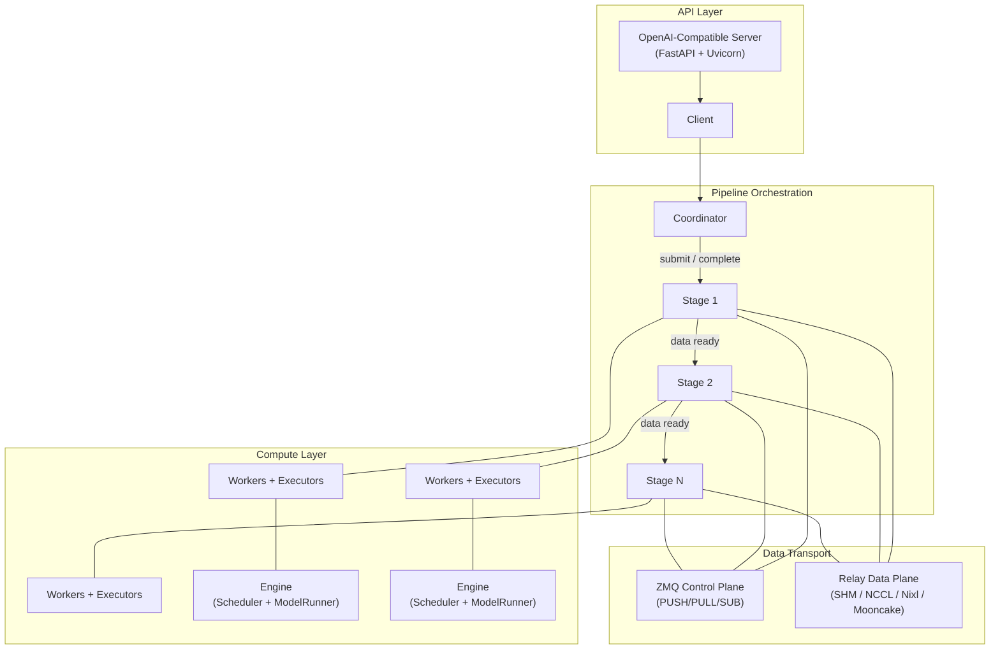
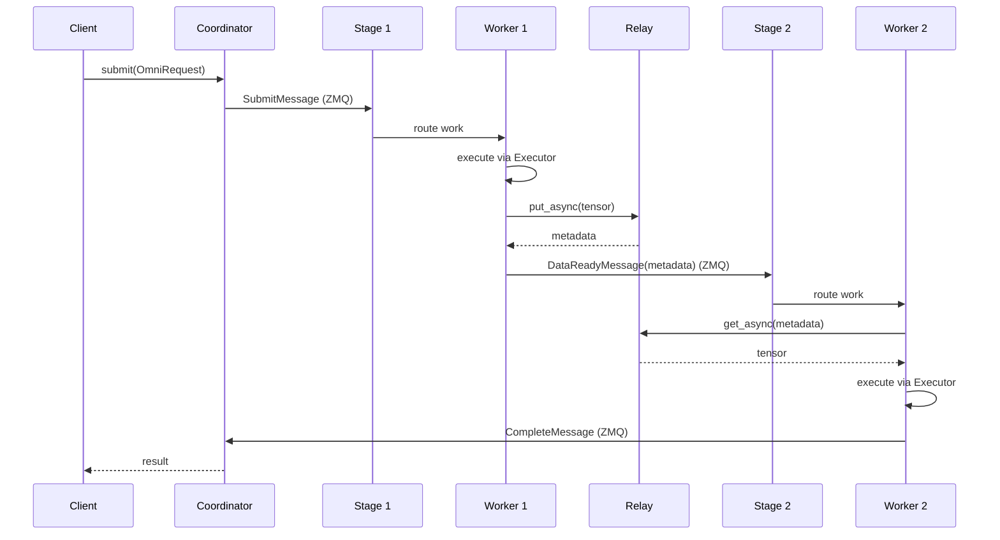
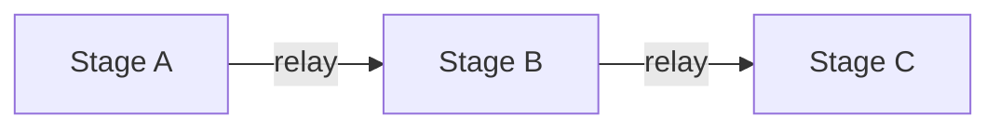
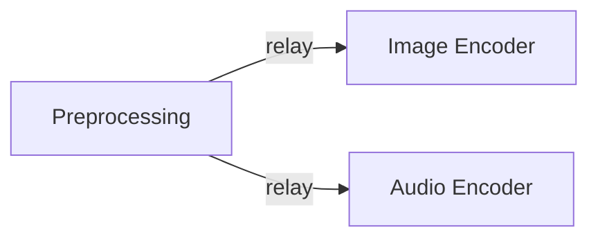
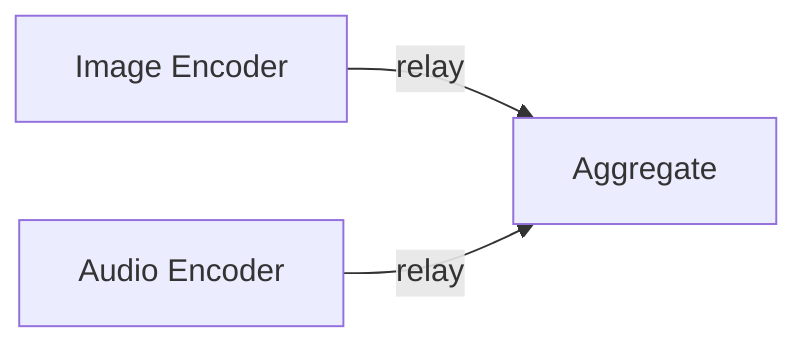
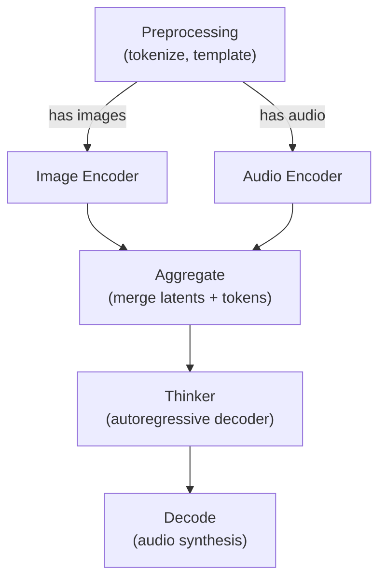

# Architecture

SGLang-Omni is a multi-stage pipeline framework for omni models — models with multimodal inputs (text, audio, images, video) and multimodal outputs. It decomposes model inference into specialized stages that can be independently scaled and deployed across heterogeneous hardware.

## Design Principles

- **Multi-stage decomposition**: Omni models contain components (encoders, decoders, thinkers) with different compute profiles. SGLang-Omni lets each stage run independently with its own resources.
- **Async-first**: The entire pipeline is built on Python asyncio for concurrent request handling and non-blocking data transfer.
- **Pluggable data relay**: Stages communicate via a relay abstraction that supports shared memory, NCCL, Nixl (RDMA), and Mooncake backends — from single-machine to multi-node deployments.
- **Configuration-driven**: Pipelines are declared as config objects, compiled into runtimes, and launched by a runner. No boilerplate wiring code needed.

## System Overview



## Module Structure

```
sglang_omni/
├── config/         # Pipeline definition, validation, and compilation
├── pipeline/       # Coordinator, stages, workers, control plane
├── engines/        # Compute backends (OmniEngine, schedulers)
├── executors/      # Worker-facing interfaces bridging stages to engines
├── models/         # Model-specific implementations (e.g., Qwen3-Omni)
├── preprocessing/  # Multimodal input processing (audio, image, video, text)
├── relay/          # Inter-stage data transfer backends
├── proto/          # Request/message types and serialization
├── client/         # High-level client wrapping the coordinator
└── serve/          # OpenAI-compatible REST API adapter
```

## Core Components

### Pipeline Config and Compilation

The config module (`sglang_omni/config/`) provides a declarative way to define pipelines. A `PipelineConfig` specifies:

- **Stages**: Each `StageConfig` names a stage, references an executor factory function, and defines a routing function (`get_next`) that determines where results go.
- **Input handling**: Stages can use `DirectInput` (pass-through) or `AggregatedInput` (fan-in from multiple upstream stages with a merge function).
- **Relay configuration**: Backend type, device, buffer sizes, and flow control credits.
- **Endpoints**: ZMQ endpoint allocation (IPC for single-machine, TCP for multi-node).

The `compile_pipeline()` function transforms the declarative config into runtime objects:

1. Validates stage names, routing, and aggregation sources.
2. Optionally applies **stage fusion** — merging consecutive stages into a single worker to avoid relay overhead.
3. Allocates ZMQ endpoints.
4. Instantiates executors from factory functions.
5. Returns a `(Coordinator, [Stage, ...])` tuple.

The `PipelineRunner` manages the lifecycle — starting the coordinator and all stages, then waiting for completion or errors.

For managed IPC startup, prefer `build_pipeline_runner()`. The lower-level
`compile_pipeline()` helper rejects unmanaged IPC usage.

### Coordinator

The `Coordinator` (`sglang_omni/pipeline/coordinator.py`) is the central request manager. It:

- Registers stages and their ZMQ control endpoints.
- Tracks every request through its lifecycle: `PENDING → RUNNING → COMPLETED / FAILED / ABORTED`.
- Submits requests to the entry stage.
- Receives completion messages and resolves per-request futures.
- Broadcasts abort signals to all stages via ZMQ PUB/SUB.
- Supports both blocking (`submit()`) and streaming (`stream()`) request patterns.

### Stage

A `Stage` (`sglang_omni/pipeline/stage/runtime.py`) is a processing unit that:

- Receives incoming work via the ZMQ control plane.
- Applies an input handler — either passing data directly or waiting for and merging inputs from multiple upstream stages.
- Routes work to its worker pool using round-robin with sticky affinity (subsequent requests from the same source go to the same worker for cache locality).
- Manages a relay instance for downstream data transfer.
- Forwards completed results to the next stage(s) based on the routing function.

### Worker

Each `Worker` (`sglang_omni/pipeline/worker/runtime.py`) is a stateless request processor within a stage. It:

- Dequeues work items from its stage.
- Loads inputs — either inline or by fetching tensors from the relay using metadata.
- Delegates execution to an `Executor`.
- Dispatches results back to the stage for routing to downstream stages.
- Handles many concurrent in-flight requests via asyncio tasks.

### Control Plane

The control plane (`sglang_omni/pipeline/control_plane.py`) uses ZMQ sockets for inter-stage messaging:

| Socket | Direction | Purpose |
|--------|-----------|---------|
| PULL   | Receive   | Incoming work submissions |
| PUSH   | Send      | Forward work to next stages |
| SUB    | Receive   | Abort broadcasts from coordinator |

Message types include `SubmitMessage`, `DataReadyMessage`, `CompleteMessage`, `AbortMessage`, `StreamMessage`, and `ShutdownMessage`, all serialized with msgpack.

### Executors

Executors (`sglang_omni/executors/`) bridge stages to compute backends:

- **`PreprocessingExecutor`**: Wraps pure functions (e.g., tokenization, input normalization) as an executor interface.
- **`EngineExecutor`**: Adapts an `Engine` (with batching and scheduling) to the executor interface, using request/result builders for payload transformation.
- **`FusedExecutor`**: Chains multiple executors sequentially when stages are fused during compilation.

### Engines

The engines module (`sglang_omni/engines/`) provides compute backends:

- **`OmniEngine`**: The main engine combining a `Scheduler` and `ModelRunner`. Its loop is: `schedule() → cache check → execute() → cache update → update()`.
- **`Scheduler`**: Model-agnostic request lifecycle manager. Manages states (`WAITING → RUNNING → FINISHED`), delegates to pluggable components: `BatchPlanner`, `ResourceManager`, `IterationController`.
- **`ModelRunner`**: Stateless executor that consumes `SchedulerOutput` and calls the model forward pass.

### Relay

The relay module (`sglang_omni/relay/`) provides high-performance inter-stage data transfer. See [Relay Design](./relay_design.md) for full details.

| Backend | Transport | Scope | Use Case |
|---------|-----------|-------|----------|
| SHM     | Shared memory | Single machine | Low-overhead, any GPU config |
| NCCL    | GPU collectives | Multi-GPU | Synchronized GPU-GPU transfer |
| Nixl    | RDMA | Multi-node | High-bandwidth cluster deployments |
| Mooncake | Cloud-optimized | Multi-node | Cloud environments |

All backends implement the same `Relay` interface with `put_async()` / `get_async()` and are selected via a registry pattern.

## Request Lifecycle



1. The **Client** submits an `OmniRequest` to the **Coordinator**.
2. The Coordinator sends a `SubmitMessage` to the **entry stage** via ZMQ.
3. The stage's **input handler** processes the request and the **router** assigns it to a worker.
4. The **Worker** executes the request through its **Executor**.
5. If there is a downstream stage, the worker writes output tensors to the **Relay** and sends a `DataReadyMessage` with relay metadata to the next stage.
6. The next stage's worker fetches the tensor from the relay and continues processing.
7. The final stage sends a `CompleteMessage` back to the Coordinator.
8. The Coordinator resolves the client's future with the result.

## Data Flow Patterns

### Sequential



The simplest pattern: each stage passes its output to the next.

### Fan-Out



A routing function directs the output to multiple downstream stages in parallel. Used when different modalities require separate encoders.

### Fan-In (Aggregation)



An aggregated input handler waits for all upstream sources, then merges them with a custom function before passing to the worker.

### Qwen3-Omni Pipeline Example

A concrete example of these patterns combined:



Preprocessing fans out to active encoders based on input modalities. The aggregate stage fans in, merging encoder outputs with text tokens. The thinker runs autoregressive decoding, and the decode stage synthesizes audio output.

## Configuration Example

```python
from sglang_omni.config import (
    ExecutorConfig, PipelineConfig, StageConfig,
    build_pipeline_runner,
)

config = PipelineConfig(
    name="my_pipeline",
    entry_stage="preprocess",
    stages=[
        StageConfig(
            name="preprocess",
            executor=ExecutorConfig(
                factory="my_project.executors.create_preprocess",
                args={},
            ),
            get_next="my_project.routing.preprocess_next",
        ),
        StageConfig(
            name="thinker",
            executor=ExecutorConfig(
                factory="my_project.executors.create_thinker",
                args={"model_path": "Qwen/Qwen3-Omni"},
            ),
            get_next="my_project.routing.end",
        ),
    ],
)

runner = build_pipeline_runner(config)
```

## Communication Layers

| Layer | Technology | Purpose |
|-------|-----------|---------|
| Control plane | ZMQ (PUSH/PULL/SUB) | Stage-to-stage work submission, abort broadcasts |
| Data plane | SHM / NCCL / Nixl / Mooncake | Tensor transfer between stages |
| Request tracking | In-memory dict + asyncio futures | Coordinator request lifecycle |
| Worker scheduling | asyncio + queues | Concurrent request dispatch within stages |
| External API | FastAPI + Uvicorn | OpenAI-compatible HTTP endpoints |

## Key Design Decisions

**Why ZMQ for the control plane?**
ZMQ provides lightweight, brokerless messaging with flexible socket patterns (PUSH/PULL for work distribution, PUB/SUB for broadcasts). It avoids the overhead of a message broker while supporting both IPC and TCP transports.

**Why separate control and data planes?**
Control messages (submit, complete, abort) are small and latency-sensitive. Tensor data is large and throughput-sensitive. Separating them allows each to use the optimal transport — ZMQ for control, RDMA/NCCL for data.

**Why configuration-driven pipelines?**
Declarative configs make pipelines reproducible, versionable, and easy to modify. The compilation step handles all wiring, endpoint allocation, and optimization (like stage fusion) automatically.

**Why sticky worker affinity?**
When a request returns to the same stage (e.g., for iterative decoding), routing it to the same worker preserves KV cache locality, avoiding redundant recomputation.
