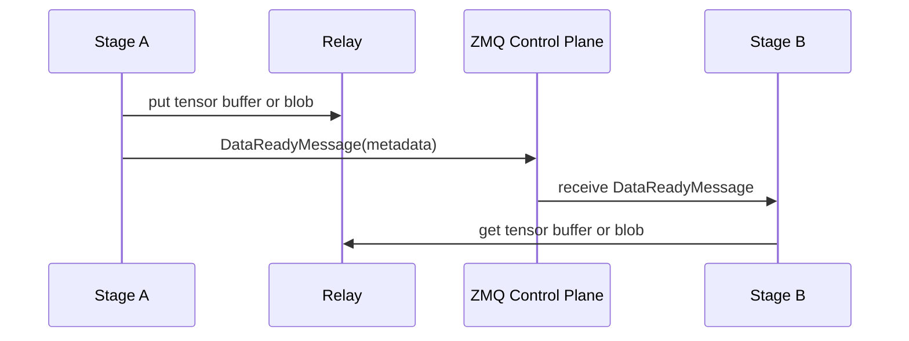

# Communication

For the communication among stages in sglang-omni, the control plane moves small
coordination messages over ZMQ; the data plane uses relay for cross-process
tensors and tensor-like blobs, with process-local shortcuts for selected
same-process edges.

The main implementation entry points are:


| File                                            | Role                                                                  |
| ------------------------------------------------- | ----------------------------------------------------------------------- |
| `sglang_omni/pipeline/control_plane.py`         | ZMQ sockets, msgpack serialization, stage/coordinator message routing |
| `sglang_omni/pipeline/relay_io.py`              | Stage-facing payload and stream transfer helpers                      |
| `sglang_omni/pipeline/local_dispatch.py`        | Same-process Python object dispatch between colocated stages          |
| `sglang_omni/relay/base.py`                     | Backend interface and backend registry                                |
| `sglang_omni/relay/{shm,nccl,nixl,mooncake}.py` | Concrete relay backends                                               |
| `sglang_omni/proto/messages.py`                 | Control-plane message types                                           |

## Two Planes




| Plane                     | Transport                    | Carries                                                                                                      |
| --------------------------- | ------------------------------ | -------------------------------------------------------------------------------------------------------------- |
| Control                   | ZMQ`PUSH/PULL`               | `SubmitMessage`, `DataReadyMessage`, `CompleteMessage`, `StreamMessage`, `ShutdownMessage`, profiler control |
| Broadcast control         | ZMQ`PUB/SUB`                 | `AbortMessage`                                                                                               |
| Data                      | Relay backend                | Full`StagePayload` tensor buffers and cross-GPU stream blobs                                                 |
| Same-process fast path    | LOCAL_OBJECT                 | Full`StagePayload` objects and stream chunks passed by Python reference within one OS process                |
| Same-GPU stream fast path | CUDA IPC via`ForkingPickler` | Stream chunks and stream metadata tensors when sender and receiver share the same primary GPU                |

`DataReadyMessage.shm_metadata` is the bridge between the planes. The field name
is historical; today it carries generic relay metadata, not only shared-memory
metadata. The message itself may also carry stream fields such as `chunk_id`,
`is_done`, and `error`.

## Normal Payload Flow

The coordinator submits the first `StagePayload` directly to the entry stage in a
`SubmitMessage`. After that, stage-to-stage payloads normally use relay. A
same-process edge may use LOCAL_OBJECT instead when the runtime has registered
the target in the same OS process and the route is safe for reference passing.

1. The sender calls `relay_io.write_payload(relay, request_id, payload)`.
2. `write_payload()` recursively extracts tensors from `payload.data`, replaces
   them with placeholders, pickles the tensor-free `StagePayload`, and
   concatenates tensors into one `uint8` buffer.
3. The sender calls `relay.put_async()` for that buffer and sends a
   `DataReadyMessage` containing:
   - `relay_info`: backend-specific metadata from `RelayOperation.metadata`
   - `payload_pickle`: base64-encoded `StagePayload` without tensors
   - `tensor_info`: path, shape, dtype, offset, and byte size for each tensor
4. The receiver handles the message in `Stage._on_data_ready()`, calls
   `relay_io.read_payload()`, waits for `relay.get_async()`, restores tensors,
   and passes the payload through the stage input handler.
5. If fan-in is complete, the stage enqueues an `IncomingMessage` into
   `scheduler.inbox`.

The payload relay format is intentionally backend-neutral. Backends only need to
move a flat tensor buffer and return metadata that another backend instance can
use for `get_async()`.

LOCAL_OBJECT bypasses relay and the ZMQ `DataReadyMessage`: the sender calls the
process-local dispatcher, which invokes `receive_local_payload()` on the target
stage with the projected `StagePayload` object itself. This is a direct Python
reference transfer, not serialization. Receivers must treat the payload, nested
data containers, tensors, stream chunks, and metadata as read-only. The object
must also stay valid for the receiver's scheduler queue lifetime; senders and
projection functions must not mutate or recycle objects after dispatch.

For full payloads, LOCAL_OBJECT is allowed for single-target same-process routes.
For fan-out, it is allowed only when each projected payload is a `StagePayload`
with its own `data` container, so downstream stages do not share mutable payload
state. Tensor leaves may still be shared intentionally and must be treated as
read-only.

## Streaming Flow

Streaming is used for producer-consumer edges such as thinker to talker hidden
states or talker to vocoder codec codes. The stage layer exposes one sending
helper, `relay_io.send_stream_chunk()`, because the sender must choose the
transport path.

For same-GPU stream targets:

- runtime prep detects targets whose sender and receiver share the same
  primary GPU
- `send_stream_chunk()` serializes the chunk with `ForkingPickler`
- CUDA tensors are shared through CUDA IPC instead of copied through relay
- the `DataReadyMessage` carries `_ipc=True` metadata and a `chunk_id`

For same-process stream targets:

- the stage sends the chunk through `LocalStageDispatcher.send_stream_chunk()`
- the receiver gets the original Python object and metadata by reference
- the same read-only and lifetime caveats as payload LOCAL_OBJECT apply

For cross-GPU stream targets:

- the chunk is written with `write_blob()`
- tensor-valued metadata is extracted and written as separate blob transfers
- the control message is sent before waiting for pending put operations
- the receiver reads the blob in `Stage._on_stream_chunk()` and enqueues a
  `stream_chunk` message into `scheduler.inbox`

The control-before-wait ordering is important for NIXL and other credit-based
backends. If the sender waited for completion before notifying the receiver, the
receiver would never start the read that releases the sender's credit.

Stream completion and stream errors are control-only messages sent with
`send_stream_signal()`.

## Relay Interface

All backends implement `Relay`:

```python
class Relay:
    async def put_async(
        self, tensor: torch.Tensor, request_id: str | None = None, dst_rank: int | None = None
    ) -> RelayOperation: ...

    async def get_async(
        self, metadata: Any, dest_tensor: torch.Tensor, request_id: str | None = None
    ) -> RelayOperation: ...

    def cleanup(self, request_id: str) -> None: ...
    def close(self) -> None: ...
```

`put_async()` returns a `RelayOperation` whose `metadata` is placed in the
control message. Both put and get operations expose
`await wait_for_completion(timeout=...)`. Stages keep the operation alive until
the transfer is safe to release.

## Backends

`PipelineConfig.relay_backend` accepts `shm`, `nccl`, `nixl`, or `mooncake`.
`RelayConfig` can override slot size, credits, rank, world size, and device per
stage. If no per-stage relay config is provided, runtime prep infers the relay
device from stage placement. For `shm`, it keeps relay buffers on CPU because
the backend copies through host shared memory.


| Backend    | Current behavior                                                                                                                                                            |
| ------------ | ----------------------------------------------------------------------------------------------------------------------------------------------------------------------------- |
| `shm`      | Creates a Python shared-memory block, copies tensor bytes into it, and lets the receiver copy out and unlink the block. Useful for local process transfer and CPU fallback. |
| `nccl`     | Uses`torch.distributed` NCCL `isend`/`irecv` with explicit send and receive rank topology. Useful for GPU-to-GPU transfer inside an NCCL world.                             |
| `nixl`     | Uses a preallocated registered memory pool, NIXL agent metadata, remote reads, completion notifications, and credits for safe buffer reuse.                                 |
| `mooncake` | Uses Mooncake Transfer Engine with a registered memory pool, P2P session metadata, protocol selection, notifications, and credits.                                          |

Each backend owns only transport mechanics. It does not route requests, perform
fan-in, choose downstream stages, or interpret model payloads.

## Resource Lifetime

The stage layer follows a simple ownership rule:

- sender writes data, sends `DataReadyMessage`, then waits for the put operation
  when required by the backend
- receiver allocates the destination buffer, waits for the get operation,
  restores the payload, and calls `relay.cleanup(request_id)`
- LOCAL_OBJECT has no backend cleanup; sender and receiver share Python object
  references, so correctness depends on read-only use until the receiver is done
- aborts call `relay.cleanup(request_id)` from the stage abort path
- stage shutdown calls `relay.close()`

Backend-specific cleanup is hidden behind that interface. For example, `shm`
unlinks blocks on receive, NIXL and Mooncake release memory-pool credits after
completion, and NCCL tears down the process group on close.
